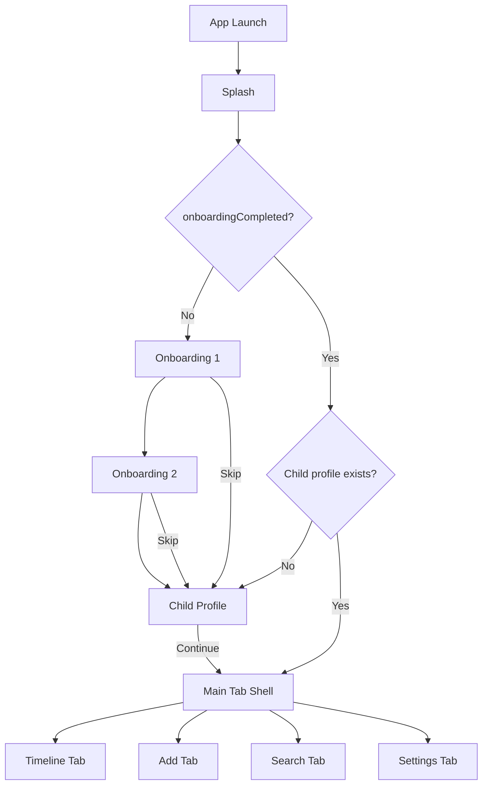

# LittleSteps — Implementation Plan

**Status:** Draft for review — no production code until approved  
**Last updated:** 2026-06-03  
**Audience:** iOS and Android engineers implementing the LittleSteps MVP

---

## Executive Summary

LittleSteps is an **offline-first** mobile app that helps parents record and organize a single child’s **milestones** and **memories**, browse them on a **timeline**, **search** by text and tags, and adjust **theme** settings.

This plan maps the MVP to the repository’s documented engineering patterns (MVVM-C, pragmatic Clean Architecture, feature-first folders, repository-isolated persistence) while aligning UI with the [Figma Make prototype](https://www.figma.com/make/rMK8xQv9lgcd2TQqv3McZH/Mobile-UI-Design-for-LittleSteps).

**Critical finding:** The prompt references documentation in `common/`, `ios/`, and `android/`. At review time:

| Path | Expected | Actual |
|------|----------|--------|
| `common/` | Shared product/domain docs | **Does not exist** |
| `ios/` | iOS-specific docs | **Does not exist** — iOS docs live in root `docs/` |
| `android/` | Android project + docs | **Exists** — `android/docs/` + FocusUp Android app |

Root `docs/` and `android/docs/` describe **FocusUp** (productivity/timer app), not LittleSteps. **Figma** and the bootstrap prompt are the authoritative **product** source for LittleSteps; **architecture/process** docs should be followed for *how* to build, with domain/features replaced as specified below.

**Recommended repo strategy:** Add a **greenfield** LittleSteps app (iOS + Android) in this monorepo, reusing **patterns** from FocusUp—not refactoring FocusUp in place. See §10 (Risks).

---

## 1. Architecture Understanding

### 1.1 Target architecture (both platforms)

Follow the documented layered model:

```text
┌────────────────────┐
│   UI (Views)       │  SwiftUI / Jetpack Compose
└─────────┬──────────┘
          │
          ▼
┌────────────────────┐
│   ViewModels       │  @Observable (iOS) / StateFlow (Android)
│   Coordinators     │  Navigation only — no business logic
└─────────┬──────────┘
          │
          ▼
┌────────────────────┐
│   Use Cases        │  Grouped workflows (not CRUD-per-file)
└─────────┬──────────┘
          │
          ▼
┌────────────────────┐
│   Repositories     │  Protocol / interface in Domain
└─────────┬──────────┘
          │
          ▼
┌────────────────────┐
│   Persistence      │  SwiftData (iOS) / Room + DataStore (Android)
│   File storage     │  Entry photos on disk
└────────────────────┘
```

### 1.2 iOS stack (from `docs/architecture.md`, `docs/cursor_rules.md`)

| Area | Technology |
|------|------------|
| UI | SwiftUI |
| Architecture | MVVM-C + pragmatic Clean Architecture |
| State | Observation (`@Observable`) |
| Navigation | `NavigationStack`, typed routes, tab coordinators |
| Persistence | SwiftData |
| Async | `async/await`, `@MainActor` ViewModels |
| Testing | Swift Testing |
| Min platform | iOS 17.5+ |
| Restoration | `@SceneStorage` for ephemeral UI only |

**Explicitly excluded for LittleSteps MVP** (per bootstrap prompt; overrides FocusUp docs where they mention timers, notifications, ActivityKit):

- UserNotifications / notification scheduler
- ActivityKit / Live Activities
- Background timer services
- Focus/Rest session managers

### 1.3 Android stack (from `android/docs/architecture.md`)

| Area | Technology |
|------|------------|
| UI | Jetpack Compose |
| Architecture | MVVM + pragmatic Clean Architecture |
| State | `StateFlow` + immutable `UiState` |
| Navigation | Navigation Compose + typed routes |
| DI | Hilt |
| Persistence | Room + DataStore |
| Testing | JUnit, MockK, coroutines-test |
| Min SDK | API 26+ (per Android docs) |

**Excluded:** Firebase, FCM, foreground timer service, widgets.

### 1.4 LittleSteps domain boundaries

| Concept | MVP behavior |
|---------|----------------|
| **Child profile** | Exactly one profile stored locally; no multi-child picker UI |
| **Timeline entry** | Unified model with `kind`: `milestone` \| `memory`; optional subtype chips on Add screen (Growth, Quote map to `memory` + tag) |
| **Timeline** | Chronological feed grouped by year → month |
| **Search** | Full-text on title/note + filter by tag; recent results |
| **Settings** | Theme only (Light / Dark / System); no account section |
| **Onboarding** | First-run only; completes when child profile saved |
| **Splash** | Cold-start branding; routes to onboarding or main |

### 1.5 Coordinators vs ViewModels

Per `docs/architecture.md`:

- **Coordinators:** tab selection, push/pop, sheet presentation, onboarding gate
- **ViewModels:** screen state, validation, repository/use-case calls
- **Views:** declarative UI only; no SwiftData/Room access

---

## 2. Folder Structure Understanding

### 2.1 Documentation layout (target vs current)

**Target monorepo layout** (recommended after doc migration):

```text
LittleSteps/                    # repo root (rename optional)
├── common/
│   ├── product_requirements.md
│   ├── domain_glossary.md
│   ├── feature_breakdown.md
│   └── design_tokens.md        # Figma-derived tokens
├── ios/
│   ├── docs/                   # iOS-specific deltas
│   └── LittleSteps/            # Xcode app target
├── android/
│   ├── docs/
│   └── LittleSteps/            # Gradle app module
└── docs/
    └── implementation_plan.md  # this file
```

**Current state:** FocusUp iOS app at `FocusUp/`, Android at `android/FocusUp/`, shared docs at `docs/` (FocusUp content).

### 2.2 iOS app structure (LittleSteps)

Mirror `docs/folder_structure.md` with LittleSteps features:

```text
LittleSteps/
├── App/
│   ├── AppEntry/
│   │   ├── LittleStepsApp.swift
│   │   └── AppRootView.swift
│   ├── Navigation/
│   │   ├── AppCoordinator.swift
│   │   ├── AppTab.swift
│   │   ├── OnboardingCoordinator.swift
│   │   └── Routes/
│   └── DependencyInjection/
│       └── AppContainer.swift
├── Features/
│   ├── Splash/
│   ├── Onboarding/
│   ├── ChildProfile/
│   ├── Timeline/
│   ├── AddEntry/
│   ├── Search/
│   └── Settings/
├── Core/
│   ├── DesignSystem/
│   ├── Components/
│   ├── Responsive/
│   ├── Extensions/
│   └── Utilities/
├── Domain/
│   ├── Models/
│   ├── UseCases/
│   └── Repositories/           # protocols only
├── Data/
│   ├── Persistence/
│   │   ├── Entities/
│   │   └── PersistenceController.swift
│   ├── Repositories/
│   ├── Mappers/
│   └── Services/
│       └── PhotoStorageService.swift
└── Resources/
    └── Assets.xcassets
```

**Reference implementation:** Existing FocusUp folders (`FocusUp/App/`, `FocusUp/Core/Navigation/`, `FocusUp/Data/Persistence/`) demonstrate the same skeleton.

### 2.3 Android app structure (LittleSteps)

Mirror `android/docs/folder_structure.md`:

```text
com.littlesteps/
├── app/                        # Application, MainActivity, NavHost
├── core/                       # extensions, di
├── designsystem/               # theme, tokens, shared composables
├── domain/
│   ├── model/
│   ├── repository/
│   └── usecase/
├── data/
│   ├── local/db/
│   ├── datastore/
│   ├── mapper/
│   ├── repository/
│   └── service/PhotoStorageService.kt
├── feature_splash/
├── feature_onboarding/
├── feature_childprofile/
├── feature_timeline/
├── feature_addentry/
├── feature_search/
└── feature_settings/
```

Single `:app` module for MVP-1 (per Android docs).

### 2.4 Tests

| Platform | Location | Focus |
|----------|----------|-------|
| iOS | `LittleStepsTests/` | Use cases, repositories, ViewModels, mappers |
| Android | `app/src/test/` | Same layers |
| UI (sparse) | `LittleStepsUITests/` / `androidTest` | Onboarding → timeline smoke |

---

## 3. Dependency Graph

### 3.1 Module-level (logical)

```text
                    ┌──────────────┐
                    │  App / DI    │
                    └──────┬───────┘
           ┌───────────────┼───────────────┐
           ▼               ▼               ▼
    ┌────────────┐  ┌────────────┐  ┌────────────┐
    │  Features  │  │    Core    │  │  Resources │
    └─────┬──────┘  └────────────┘  └────────────┘
          │
          ▼
    ┌────────────┐
    │   Domain   │  ← no UI / no persistence imports
    └─────┬──────┘
          │
          ▼
    ┌────────────┐
    │    Data    │  ← SwiftData / Room, file I/O
    └────────────┘
```

**Rule:** Features → Domain → Data. Core is consumed by Features. No Feature → Feature imports except via Domain events or coordinator.

### 3.2 Runtime dependency container (iOS)

`AppContainer` (pattern from `FocusUp/Core/DependencyInjection/AppContainer.swift`):

```text
AppContainer
├── persistence: PersistenceController
├── coordinator: AppCoordinator
├── repositories: Repositories
│   ├── childProfileRepository
│   ├── timelineEntryRepository
│   └── userPreferencesRepository
├── photoStorage: PhotoStorageService
└── useCases (optional grouping)
    ├── OnboardingUseCase
    ├── TimelineUseCase
    ├── AddEntryUseCase
    └── SearchUseCase
```

Inject via `@Environment(\.appContainer)` (same as FocusUp).

### 3.3 Android Hilt modules

```text
AppModule
├── provides Database, DAOs
├── provides DataStore
├── binds Repository implementations
└── provides PhotoStorageService
```

ViewModels: `@HiltViewModel` + constructor injection.

### 3.4 Feature dependency matrix

| Feature | Repositories | Use cases | Other |
|---------|--------------|-----------|-------|
| Splash | `UserPreferencesRepository` | — | Routes by `onboardingCompleted` |
| Onboarding | `UserPreferencesRepository` | `OnboardingUseCase` | Coordinator |
| ChildProfile | `ChildProfileRepository` | `ChildProfileUseCase` | `PhotoStorageService` |
| Timeline | `TimelineEntryRepository`, `ChildProfileRepository` | `TimelineUseCase` | — |
| AddEntry | `TimelineEntryRepository` | `AddEntryUseCase` | `PhotoStorageService` |
| Search | `TimelineEntryRepository` | `SearchUseCase` | — |
| Settings | `UserPreferencesRepository` | — | Theme environment |

---

## 4. Feature Breakdown

### 4.1 Splash

**Figma:** Footprint logo, “LittleSteps”, tagline, loading indicator.

| Item | Detail |
|------|--------|
| **Purpose** | Brand moment; decide initial route |
| **Route** | If `!onboardingCompleted` → Onboarding 1; else if no child profile → Child Profile; else → Timeline tab |
| **Duration** | ~1–1.5s minimum display; no blocking network |
| **iOS files** | `SplashView.swift`, `SplashViewModel.swift` |
| **Android** | `feature_splash/ui/SplashScreen.kt` |

### 4.2 Onboarding (steps 1–2)

**Figma:** Illustration-heavy; Skip; progress dots; “Get Started” / “Next”; “Sign in” footer.

| Item | Detail |
|------|--------|
| **Step 1** | “Capture memories that last forever” |
| **Step 2** | “Your child’s story, beautifully organized” |
| **Sign in** | **Non-functional in MVP** — show styled text only or hide per product decision (§10) |
| **Skip** | Jumps to Child Profile (step 3) |
| **Persistence** | Mark onboarding pages seen; `onboardingCompleted` set after profile save |
| **iOS** | `OnboardingContainerView`, `OnboardingPage1View`, `OnboardingPage2View`, `OnboardingCoordinator` |
| **Android** | `OnboardingNavHost` with two routes |

### 4.3 Child Profile (onboarding step 3)

**Figma:** Name, birthday, optional gender, avatar picker, “Continue”.

| Item | Detail |
|------|--------|
| **Fields** | `name` (required), `birthday` (required), `gender` (optional enum), `photoFileName` (optional) |
| **Validation** | Name non-empty; birthday not in future |
| **Age display** | Computed elsewhere from birthday — not stored as source of truth |
| **Single child** | `save` replaces existing profile if any |
| **iOS** | `ChildProfileView`, `ChildProfileViewModel`, `ChildProfileUseCase` |
| **Android** | `ChildProfileScreen`, `ChildProfileViewModel` |

### 4.4 Timeline (main tab)

**Figma:** Greeting, child name journey title, avatar, stats (Age / Milestones / Memories), vertical timeline with year/month markers, cards with photo, kind badge, emoji, tag.

| Item | Detail |
|------|--------|
| **Header stats** | Derived: age from birthday; counts by `kind` |
| **Grouping** | `TimelineGroupingService`: year → month → entries (newest first within month) |
| **Filter button** | MVP: sheet with kind filter (All / Milestone / Memory) — infer from Figma “Filter” |
| **Card tap** | MVP: optional read-only detail sheet (not in Figma; infer from patterns) or defer |
| **Empty state** | Encouraging CTA to Add tab |
| **iOS** | `TimelineView`, `TimelineViewModel`, `TimelineCardView`, `TimelineYearHeader`, `KindBadge` |
| **Android** | `TimelineScreen`, `TimelineEntryCard` |

### 4.5 Add Entry (tab)

**Figma:** Cancel / Save nav; type grid (Milestone, Memory, Growth, Quote); photo upload; title, date, age (editable display), note, tag chips.

| Item | Detail |
|------|--------|
| **Entry kinds** | `milestone`, `memory` in DB; Growth/Quote → `memory` with suggested tags |
| **Date** | User-selected; default today |
| **Age label** | Auto-computed from child birthday + date; user can override string for display |
| **Photo** | `PhotosPicker` / Android picker → save to app documents → store filename on entity |
| **Tags** | Single primary tag from chips + freeform optional later; MVP: one tag string |
| **Save** | Validates title; persists entry; switches to Timeline tab or pops |
| **Cancel** | Discards draft |
| **iOS** | `AddEntryView`, `AddEntryViewModel`, form components |
| **Android** | `AddEntryScreen` |

### 4.6 Search (tab)

**Figma:** Search field, “Browse by Tag”, “Recent” results.

| Item | Detail |
|------|--------|
| **Query** | Debounced search on title + note |
| **Tags** | Distinct tags from entries; tap applies filter |
| **Recent** | Last N entries by `updatedAt` or `occurredOn` |
| **Results** | Reuse timeline card component |
| **iOS** | `SearchView`, `SearchViewModel` |
| **Android** | `SearchScreen` |

### 4.7 Settings (tab — inferred)

**Figma:** Tab icon present; no dedicated screen in Make file.

| Item | Detail |
|------|--------|
| **MVP scope** | Appearance: Light / Dark / System (per bootstrap prompt) |
| **Infer UI** | List row style matching Figma cards; purple accent; same nav bar as Search |
| **Optional rows** | About / version (pattern from FocusUp `AboutView`) |
| **Exclude** | Notifications, account, export, child management |
| **iOS** | `SettingsView`, `AppearanceSettingsView`, `ThemeManager` |
| **Android** | `SettingsScreen`, DataStore theme key |

### 4.8 Shared design system components

From Figma tokens (override FocusUp indigo palette):

| Token | Value | Usage |
|-------|-------|-------|
| `purple` | `#7C5CFA` | Primary brand, CTAs, active tab |
| `purpleLight` | `#EDE8FF` | Backgrounds, chips |
| `gold` | `#F6C453` | Memory badges, accents |
| `background` | `#FAFAFA` | Screen background |
| `ink` | `#1A1028` | Primary text |
| `inkFaint` | `#9B94B3` | Secondary text |

**Components to build:**

- `AppBottomTabBar` (4 tabs: Timeline, Add, Search, Settings)
- `KindBadge` (milestone vs memory)
- `TimelineEntryCard`
- `TagChip` / `FilterChip`
- `PrimaryGradientButton`
- `FormTextField`, `FormDateRow`
- `PhotoPickerArea`
- `ChildAvatarView`
- `ResponsiveContainer` (reuse pattern from FocusUp)

Typography: SF Pro / system; scale from `docs/design_system.md` §6.

Spacing: xs=4 … xxxl=40 from `docs/design_system.md` §7.

Corner radius: cards 18–22pt; buttons 18pt (Figma).

---

## 5. Persistence Strategy

### 5.1 Principles (from `docs/persistence.md`)

- SwiftData/Room entities stay in Data layer
- Domain models are framework-free structs
- Repositories are the only persistence boundary
- Views/ViewModels never hold `ModelContext` / DAOs

### 5.2 Domain models

```swift
// Illustrative — final names in Domain/Models/

struct ChildProfile {
    let id: UUID
    var name: String
    var birthday: Date
    var gender: ChildGender?   // .girl, .boy, .unspecified
    var photoFileName: String?
    let createdAt: Date
    var updatedAt: Date
}

enum EntryKind: String, Codable {
    case milestone
    case memory
}

struct TimelineEntry {
    let id: UUID
    var kind: EntryKind
    var title: String
    var note: String
    var emoji: String
    var tag: String
    var occurredOn: Date          // calendar day semantics (start of day)
    var ageLabel: String          // display string e.g. "12 months"
    var photoFileName: String?
    let createdAt: Date
    var updatedAt: Date
}

struct UserPreferences {
    var selectedTheme: AppTheme    // .light, .dark, .system
    var onboardingCompleted: Bool
    var hasSeenOnboardingPages: Bool
}
```

### 5.3 SwiftData entities (iOS)

```text
ChildProfileEntity      @Model, @Attribute(.unique) id
TimelineEntryEntity     @Model, indexed occurredOn, kind, tag
UserPreferencesEntity   @Model, singleton row pattern (fixed id)
```

**Relationships:** MVP single child — entries do **not** require FK to child (implicit single child). Optional `childProfileId` on entry for future multi-child without UI.

**Queries:**

- Timeline: fetch all entries, sort `occurredOn` descending; group in domain
- Search: `#Predicate` on title/note contains; tag exact match
- Stats: in-memory count by kind or lightweight fetch

### 5.4 Room entities (Android)

Mirror tables: `child_profile`, `timeline_entries`, `user_preferences` in DataStore for theme/onboarding flags.

### 5.5 Photo storage

| Concern | Approach |
|---------|----------|
| Storage | `Application Support/Photos/` (iOS), `filesDir/photos/` (Android) |
| DB | Store `photoFileName` only (UUID.jpg) |
| Delete | On entry delete, remove file; on photo replace, delete old file |
| Migration | Filenames stable; no blob in SQLite |

`PhotoStorageService` protocol in Domain/Data boundary.

### 5.6 Migrations

- Start `schemaVersion = 1`
- Create `Persistence/Migrations/` folder empty but present
- Android: `exportSchema = true` from day one

### 5.7 SceneStorage / SavedState

Per `docs/state_management.md`:

| Key | Storage | Content |
|-----|---------|---------|
| `selectedTab` | SceneStorage | Tab enum raw value |
| Add entry draft | SceneStorage (optional) | Encoded draft if user switches tabs mid-form |
| Onboarding page index | SceneStorage | Int during onboarding only |

**Do not** store entries or child profile in SceneStorage.

---

## 6. Navigation Strategy

### 6.1 App launch graph



### 6.2 Main tab shell

Match Figma bottom bar:

| Tab | Root | Notes |
|-----|------|-------|
| Timeline | `NavigationStack` → `TimelineView` | Default selected |
| Add | `NavigationStack` → `AddEntryView` | Save may `selectTab(.timeline)` |
| Search | `NavigationStack` → `SearchView` | |
| Settings | `NavigationStack` → `SettingsView` → `AppearanceSettings` | |

### 6.3 iOS implementation notes

- `AppCoordinator` owns `selectedTab` + `OnboardingRoute` enum for pre-main flow
- `AppRootView` switches root: `splash` \| `onboarding` \| `main` (pattern similar to FocusUp cold restore gate)
- Per-tab `NavigationPath` in tab coordinators (reuse `TabCoordinators` pattern)
- iPad: `NavigationSplitView` optional for Timeline + detail later; MVP can use centered `ResponsiveContainer` per `docs/responsive_layout_guidelines.md`

### 6.4 Android implementation notes

- Single `NavHost` with nested graphs: `onboarding`, `main`
- `MainNavHost` uses `Scaffold` + `NavigationBar` matching Figma
- Predictive back enabled
- State restoration: `rememberSaveable` for tab; `SavedStateHandle` for search query optional

### 6.5 Deep links

Defer. Coordinator API can reserve `AppDeepLink` enum for future.

---

## 7. Testing Strategy

### 7.1 Philosophy (from `docs/coding_guidelines.md`, `android/docs/testing_strategy.md`)

- Test behavior, not layout pixels
- Fake repositories + in-memory DB for integration tests
- No real time dependencies in unit tests

### 7.2 Priority matrix

| Area | Priority | Examples |
|------|----------|----------|
| `TimelineGroupingService` | Critical | Year/month grouping, sort order |
| `AgeCalculator` | Critical | Birthday + date → age label |
| `AddEntryUseCase` validation | Critical | Empty title rejected |
| `TimelineEntryRepository` | High | CRUD, search predicate |
| `ChildProfileRepository` | High | Single-child replace semantics |
| `SearchUseCase` | High | Text + tag filter |
| ViewModels | High | State transitions on save/load |
| PhotoStorageService | Medium | Save/delete file |
| UI smoke | Low | Onboarding → create entry → visible on timeline |

### 7.3 iOS test layout

```text
LittleStepsTests/
├── Domain/
│   ├── TimelineGroupingServiceTests.swift
│   └── AgeCalculatorTests.swift
├── Data/
│   ├── TimelineEntryRepositoryTests.swift
│   └── ChildProfileRepositoryTests.swift
└── Features/
    ├── AddEntryViewModelTests.swift
    └── TimelineViewModelTests.swift
```

Use `PersistenceController.preview` in-memory pattern from FocusUp.

### 7.4 Android test layout

Mirror packages under `app/src/test/java/com/littlesteps/`.

### 7.5 CI commands (when targets exist)

```bash
# iOS
xcodebuild test -scheme LittleSteps -destination 'platform=iOS Simulator,name=iPhone 16'

# Android
cd android/LittleSteps && ./gradlew test detekt
```

---

## 8. Accessibility Strategy

Apply `docs/design_system.md` §19 and `android/.cursor/rules/Accessibility/*`.

| Requirement | iOS | Android |
|-------------|-----|---------|
| Dynamic Type / font scale | `.appFont` tokens, multiline, no fixed heights | `MaterialTheme.typography`, `fontScale` previews |
| VoiceOver / TalkBack | Labels on cards (“Milestone, First Steps, June 4 2025”); tab bar labels | `contentDescription`, heading semantics |
| Touch targets | Min 44×44pt | Min 48dp |
| Color contrast | Purple on white checked for WCAG AA | Same tokens in light/dark |
| Reduced motion | Respect `@Environment(\.accessibilityReduceMotion)` | `disableAnimations` when reduced motion |
| Photos | Accessibility label from entry title | Same |

**Form accessibility:** Associate labels with fields; announce validation errors.

**Timeline:** Announce year headers as headings; cards as buttons if tappable.

---

## 9. Risks and Ambiguities

### 9.1 Documentation gaps

| Issue | Impact | Recommendation |
|-------|--------|----------------|
| `common/` and `ios/` folders missing | No LittleSteps-specific written PRD | Create `common/product_requirements.md` before coding; use this plan + Figma interim |
| Root `docs/` describes FocusUp | Engineers may implement wrong features | Treat FocusUp docs as **process** only; ignore task/timer/notification sections |
| Android docs reference FocusUp package `com.focusup` | Wrong naming if copied blindly | New package `com.littlesteps` |
| Existing FocusUp codebase in repo | Confusion about refactor vs greenfield | **Greenfield** LittleSteps targets; do not delete FocusUp until explicitly requested |

### 9.2 Product ambiguities

| Topic | Figma / prompt | Decision needed |
|-------|----------------|-----------------|
| “Sign in” on onboarding | Visible in Figma | Hide vs disabled stub (MVP: no auth) |
| Settings screen | Tab only | Confirm theme-only scope |
| Entry detail / edit | Not in Figma | MVP: add-only + delete from timeline context menu? or read-only detail |
| Filter on timeline | Button shown | Kind filter sufficient for MVP |
| Multiple tag chips on Add | Single chip selection in Figma | Single `tag` field MVP |
| Growth / Quote types | Separate tiles | Map to `memory` + preset tags |
| iPad layout | Not in Figma | Follow `responsive_layout_guidelines.md` with centered content |
| Child profile edit post-onboarding | Not shown | Defer to Settings subsection or v2 |

### 9.3 Technical risks

| Risk | Mitigation |
|------|------------|
| Large photos memory pressure | Downscale on import (max edge 2048px); JPEG compression |
| SwiftData search performance | MVP dataset small; add indexes on `title`, `tag`, `occurredOn` |
| Date/time zones | Store `occurredOn` as start-of-day in local calendar; document in `AgeCalculator` |
| Onboarding re-show | Only when `onboardingCompleted == false`; no “reset” in MVP |
| Repo rename vs coexistence | Two apps in one repo increases size; document which scheme to open |

### 9.4 Inconsistencies found (FocusUp docs vs LittleSteps prompt)

| FocusUp docs say | LittleSteps MVP |
|------------------|-----------------|
| Tabs: Dashboard, Tasks, Focus, Statistics, Settings | Tabs: Timeline, Add, Search, Settings |
| Notifications, timers, Live Activities | **Excluded** |
| Task + milestone entities | Child profile + timeline entry entities |
| Primary color #4F46E5 indigo | Figma purple #7C5CFA |
| Onboarding: nickname, hobbies, goals | Onboarding: product story + child profile |

**Resolution:** LittleSteps prompt + Figma override product content; architecture/coding docs override engineering style.

---

## 10. Suggested Implementation Order

### Phase 0 — Documentation & project scaffold (no feature UI)

1. Add `common/` docs: PRD, glossary, Figma token export
2. Create iOS `LittleSteps` Xcode target (or new repo root) — empty shell
3. Create Android `LittleSteps` module — empty `MainActivity`
4. Align `.cursor/rules` for LittleSteps features (or namespace rules)

### Phase 1 — Foundation

5. **Design system** — colors, typography, spacing, `AppButton`, `AppCard`, tab bar
6. **Persistence** — entities, mappers, `PersistenceController`, repositories (no UI)
7. **DI** — `AppContainer` / Hilt modules
8. **Domain services** — `AgeCalculator`, `TimelineGroupingService`
9. **Unit tests** for domain + repositories

### Phase 2 — Navigation shell

10. `AppCoordinator`, splash route logic, tab shell with placeholders
11. Theme manager + Settings appearance (enables dark mode testing early)

### Phase 3 — Onboarding flow

12. Splash screen
13. Onboarding pages 1–2
14. Child profile screen + photo picker + persistence
15. Wire onboarding gate → main tabs

### Phase 4 — Core features

16. Timeline screen (static mock data → live data)
17. Timeline card components + filter sheet
18. Add entry screen + validation + photo save
19. Search screen + tag browse

### Phase 5 — Polish & quality

20. Empty states, loading states, error handling
21. Accessibility pass (VoiceOver, Dynamic Type, contrast)
22. Responsive iPad layouts (`ResponsiveContainer`)
23. UI tests for critical path
24. README + update `PRODUCTION_READINESS.md` for LittleSteps

### Phase 6 — Android parity (can overlap after Phase 1)

Track the same phase order per `android/docs/feature_breakdown.md` conventions, replacing FocusUp features with LittleSteps features.

---

## Appendix A — Reference files in current repo

| Pattern | FocusUp reference path |
|---------|------------------------|
| App container | `FocusUp/Core/DependencyInjection/AppContainer.swift` |
| Coordinator | `FocusUp/Core/Navigation/AppCoordinator.swift` |
| SwiftData schema | `FocusUp/Data/Persistence/PersistenceSchema.swift` |
| Repository | `FocusUp/Data/Repositories/` |
| Mapper | `FocusUp/Data/Mappers/TaskMapper.swift` |
| Responsive layout | `FocusUp/Core/Responsive/ResponsiveContainer.swift` |
| Design tokens | `FocusUp/DesignSystem/` |
| Swift Testing | `FocusUpTests/` |

## Appendix B — Figma screen checklist

| # | Screen | Implementation priority |
|---|--------|-------------------------|
| 1 | Splash | Phase 3 |
| 2 | Onboarding 1 | Phase 3 |
| 3 | Onboarding 2 | Phase 3 |
| 4 | Child Profile | Phase 3 |
| 5 | Timeline | Phase 4 |
| 6 | Add Entry | Phase 4 |
| 7 | Search | Phase 4 |
| — | Settings (inferred) | Phase 2–3 |

## Appendix C — Approval checklist

Before production code:

- [ ] Confirm greenfield vs refactor FocusUp
- [ ] Confirm `common/` + `ios/` doc migration
- [ ] Confirm onboarding “Sign in” behavior
- [ ] Confirm entry edit/delete scope for MVP
- [ ] Confirm iOS-only first vs parallel Android
- [ ] Approve this implementation plan

---

*End of implementation plan.*
