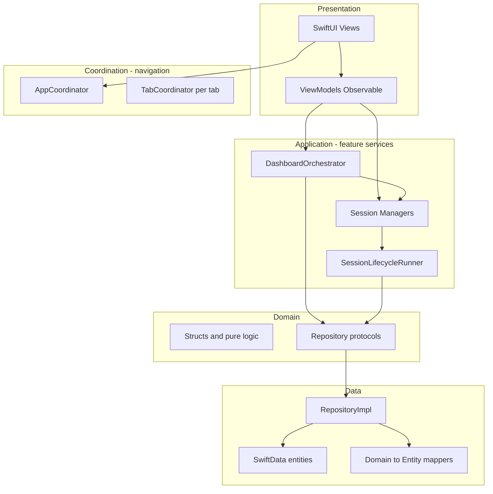

# 01 — Project Overview

## Purpose & Target Users

**FocusUp** is an offline-first iOS productivity app for people who want calm, structured focus sessions tied to real tasks — not gamified hustle culture.

| Audience | Need |
|----------|------|
| Students / knowledge workers | Pomodoro-style focus with task context |
| Users sensitive to distraction | Minimal UI, optional ambient sound, no accounts |
| Accessibility-conscious users | Dynamic Type, VoiceOver labels, Reduce Motion |

**MVP-1 scope** (per `docs/PRODUCTION_READINESS.md`): tasks, focus/rest timers, dashboard, statistics, local notifications, Live Activities, session restoration after force-quit.

---

## Main Features

| Feature | Summary |
|---------|---------|
| **Tasks** | CRUD, milestones, priorities, deadlines, filters (Today/Upcoming/Completed) |
| **Focus timer** | Preset durations, optional task link, pause/resume/complete, ambient sound |
| **Rest timer** | Break sessions under Focus tab; calm animations |
| **Dashboard** | Mood-based home, active session card, priority tasks, metrics |
| **Statistics** | Weekly chart, streaks, completion rate, focus distribution |
| **Notifications** | Session completion, deadlines, daily motivation, quiet hours |
| **Settings** | Notifications, appearance info, about |
| **Live Activities** | Lock Screen / Dynamic Island timer (iOS, ActivityKit) |

---

## High-Level Architecture

Session **Managers** (`FocusSessionManager`, `RestSessionManager`) are **not** ViewModels and **not** Domain models. They live in the **application / feature-service** layer: thin facades for focus/rest-specific side effects (audio, Live Activities, notifications). Shared pause/resume/complete/cancel/tick/restore lives in **`SessionLifecycleRunner`** (`Core/Timer/`).

| Layer | Session Managers? | Examples |
|-------|-------------------|----------|
| Presentation | No | Views, ViewModels |
| Coordination | No | `AppCoordinator`, `TabCoordinator` (navigation only) |
| **Application / feature services** | **Yes** | `FocusSessionManager`, `RestSessionManager`, `DashboardOrchestrator` |
| Domain | No | `Task`, `FocusSession`, repository **protocols** |
| Data | No | `*RepositoryImpl`, SwiftData entities |



**Pattern:** Pragmatic **Clean Architecture** + **MVVM-C** (Model–View–ViewModel–Coordinator). Documented in `docs/architecture.md`.

---

## Technology Stack

| Layer | Choice | Rationale |
|-------|--------|-----------|
| UI | SwiftUI (iOS 17.5+) | Declarative UI, `@Observable`, `NavigationStack` |
| State | Observation (`@Observable`) | Replaces `ObservableObject` boilerplate; fine-grained updates |
| Persistence | SwiftData | Native, `@Model`, fits domain mapping pattern |
| Navigation | Typed routes + coordinators | Testable; no stringly URLs |
| Notifications | `UserNotifications` | Local-only; no backend |
| Live Activities | ActivityKit | System timer surface |
| Audio | AVFoundation | Looping ambient MP3s |
| Testing | Swift Testing + Cuckoo | Modern macros; generated mocks for `Clock` |
| CI | GitHub Actions + `xcodebuild` | macOS runner, logic coverage gate |

**No backend, no Firebase, no Combine in hot paths** — intentional for MVP simplicity and interview clarity.

---

## Key Design Principles

1. **Offline-first** — all data on device via SwiftData
2. **Feature-first folders** — code colocated by product area (`Features/Tasks/`, not `ViewModels/`)
3. **Protocol-oriented repositories** — swap real / preview / mock implementations
4. **Timestamp-based timers** — `TimerEngine` uses wall-clock, not `Timer.publish`, for restoration accuracy
5. **Layered restoration** — SwiftData (authoritative) + SceneStorage (fast) + UserDefaults backup
6. **Calm UX** — design tokens, reduced motion respect, no aggressive gamification
7. **Test the brain, not pixels** — CI gates logic coverage, not SwiftUI views

---

## Folder Structure

```
FocusUp/FocusUp/
├── App/                 # @main, AppRootView
├── Core/                # DI, navigation, timer, notifications, audio, lifecycle
├── Domain/              # Pure models, calculators, validation, repository protocols
├── Data/                # SwiftData, mappers, repository implementations
├── Features/            # Feature UI + ViewModels + managers
├── DesignSystem/        # Tokens, components, motion, accessibility
├── Testing/             # Mocks, fixtures, preview data (compiled into app target)
└── Sounds/              # Bundled ambient audio
```

**Empty placeholders (intentional or deferred):** `Presentation/`, `Domain/Entities/`, `Domain/Usecases/`.

---

## Major Dependencies

| Dependency | Where | Why |
|------------|-------|-----|
| **SwiftData** | System | Persistence |
| **ActivityKit** | System (iOS) | Live Activities |
| **Cuckoo 2.3.0** | Test target only | Mock generation for `Clock` protocol |
| **No other app SPM libs** | — | Keeps binary lean; transitive deps are Cuckoo tooling |

Cuckoo config: `Cuckoofile.toml` — only `Clock` is generated; `@MainActor` protocols mocked manually (Cuckoo crash on MainActor isolation).

---

## Quick Stats (for interviews)

- ~266 Swift source files in app target
- ~72 test files, ~236 `@Test` cases
- 5 repository pairs, 5 SwiftData entities
- Logic coverage ~83% (CI gate 80%); total app ~38%
- Single CI workflow, no CD yet

---

## Related Docs

- `docs/architecture.md` — canonical architecture write-up
- `docs/persistence.md`, `docs/state_management.md`, `docs/notification_system.md`
- `docs/PRODUCTION_READINESS.md` — MVP-1 validation checklist
