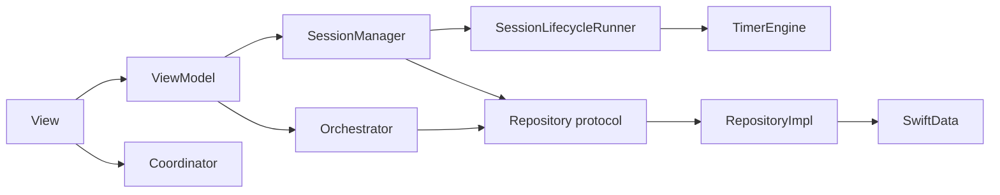
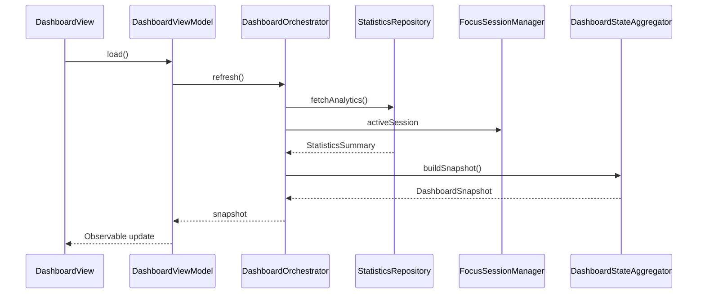

# 02 — Architecture Deep Dive

## MVVM-C + Clean Architecture

FocusUp uses **MVVM-C**, not pure MVVM:

| Layer | Responsibility | Examples |
|-------|----------------|----------|
| **View** | Layout, bindings, user events | `FocusTimerView`, `TaskListView` |
| **ViewModel** | UI state, formats display strings | `FocusTimerViewModel`, `TaskListViewModel` |
| **Coordinator** | Navigation, tab selection, deep links | `AppCoordinator`, `TabCoordinator<FocusRoute>` |
| **Model** | Domain data + rules | `Task`, `FocusSession`, `FocusAnalyticsCalculator` |

**Managers** (`FocusSessionManager`, `RestSessionManager`) sit between ViewModels and repositories — thin **application services** that wire focus/rest-specific side effects (audio, Live Activity, notifications) and delegate shared lifecycle to **`SessionLifecycleRunner`** (`Core/Timer/`), which owns `TimerEngine` + persist/restore/tick.



---

## Module Boundaries

| Module | May depend on | Must not depend on |
|--------|---------------|-------------------|
| `Domain/` | Foundation only | SwiftUI, SwiftData |
| `Data/` | Domain, SwiftData | SwiftUI Views |
| `Core/` | Domain, Data | Feature-specific Views |
| `Features/` | Domain, Core, DesignSystem | Other Features (direct) |
| `DesignSystem/` | SwiftUI | Features, Data |

**Leak to know:** `Testing/` mocks live in the **app target** (not test target) so previews and `AppContainer.preview` can use them.

---

## Data Flow (read path)

**Example: Dashboard load**

1. `DashboardView` appears → calls `DashboardViewModel.load()`
2. `DashboardViewModel` → `DashboardOrchestrator.refresh()`
3. Orchestrator `async let` fetches analytics + tasks from repositories
4. `DashboardStateAggregator.buildSnapshot()` merges statistics, tasks, active sessions
5. ViewModel sets `snapshot`, `loadingState = .loaded`
6. View renders `DashboardContentView`



**Write path (focus complete):**

`FocusTimerView` → `FocusTimerViewModel.complete()` → `FocusSessionManager.completeSession()` → `SessionLifecycleRunner` (engine + persist) → `FocusRepository` → side effects (audio, Live Activity, `NotificationScheduler.notifySessionCompleted`).

---

## Dependency Injection

**Central container:** `Core/DependencyInjection/AppContainer.swift`

```swift
@MainActor
final class AppContainer {
    let persistence: PersistenceController
    let coordinator: AppCoordinator
    let focusSessionManager: FocusSessionManager
    // ... repositories, notifications, haptics, live activities
}
```

**Injection into SwiftUI:**

```swift
.environment(\.appContainer, container)
.modelContainer(container.persistence.container)
```

Views read `@Environment(\.appContainer)`.

**Factory variants:**

| Factory | Use |
|---------|-----|
| `AppContainer.live` | Production singleton |
| `AppContainer.preview` | SwiftUI previews (in-memory, no-op services) |
| `AppContainer.testing` | Unit tests (in-memory; preview repos — known limitation) |

**Why manual DI vs. Factory/Swinject?** MVP scale; explicit graph is readable in interviews. Trade-off: `AppContainer` grows with features.

---

## State Management

| State type | Owner | Mechanism |
|------------|-------|-----------|
| Screen UI state | ViewModel | `@Observable` properties |
| Active sessions | Session managers | `@Observable`; single source of truth |
| Navigation | Coordinators | `@Observable`; `path: [Route]` per tab |
| Global services | `AppContainer` | Environment |
| Form drafts | `FormDraftManager` + SceneStorage | Survives short process death |
| User preferences | SwiftData via repository | Persistent |

**Unidirectional intent:** Views send actions → ViewModels/Managers → repositories. Views observe via `@Bindable` / `@Observable`.

**Not used:** Redux-style global store, Combine pipelines, `@StateObject` (project uses Observation).

---

## Navigation Architecture

**5 tabs:** `AppTab` — dashboard, tasks, focus, statistics, settings.

**Per-tab stack:**

```swift
TabCoordinator<FocusRoute>  // path: [FocusRoute]
```

**Route enums** (`FocusRoute`, `TasksRoute`, etc.) conform to `NavigationRoute` with `id` and `title`.

**Cross-tab navigation** via `AppCoordinator`:

- `openFocusTab(hasActiveSession:)` — selects Focus tab, pushes `.activeSession` if needed
- `openRestTab(hasActiveRestSession:)` — rest lives on Focus tab (`.restSession`)
- `selectTab(.tasks)` + `tabCoordinators.tasks.push(.detail(id))`

**Deep links:** `AppDeepLink` parsed into coordinator actions.

**Restoration:** `NavigationRestorationModifier` + `PersistedNavigationState` in SceneStorage; reconciled after cold restore so stale active-session routes are cleared.

---

## Separation of Concerns

| Concern | Location |
|---------|----------|
| Pure business rules | `Domain/` (`FocusAnalyticsCalculator`, `TaskValidation`) |
| Persistence details | `Data/Repositories/*Impl`, mappers |
| Timer math | `TimerEngine`, `TimerSnapshot` |
| UI formatting | ViewModels or `*Formatting.swift` |
| Side effects | Managers (audio, notifications, Live Activities) |
| Navigation policy | `AppCoordinator+TabNavigation` |

---

## Key Decisions & Trade-offs

| Decision | Why | Alternative | When alternative wins |
|----------|-----|-------------|----------------------|
| MVVM-C over VIPER | Simpler; coordinators match SwiftUI `NavigationStack` | VIPER | Huge teams needing strict per-screen interactor |
| SwiftData over Core Data | Modern API, less boilerplate | Core Data | Complex migrations, heavy CloudKit sync |
| Session managers vs. fat ViewModels | Testable lifecycle; shared across dashboard + timer views | All logic in VM | Very simple single-screen apps |
| Timestamp timer vs. `Timer` | Accurate after background/restore | Combine timer | Real-time games |
| Local notifications only | No server cost | Push (APNs) | Social/sync features |
| Feature folders | Onboarding speed | Layer-first (`/ViewModels`) | Cross-cutting refactors |

---

## Files to Know Cold

| File | Why |
|------|-----|
| `App/App.swift` | Entry, container bootstrap |
| `App/AppRootView.swift` | Cold restore, scene phase, restoration modifiers |
| `Core/DependencyInjection/AppContainer.swift` | Full dependency graph |
| `Core/Navigation/AppCoordinator.swift` | Navigation hub |
| `Features/Focus/Managers/FocusSessionManager.swift` | Focus-specific session facade (side effects) |
| `Core/Timer/SessionLifecycleRunner.swift` | Shared focus/rest lifecycle + `TimerEngine` |
| `Core/Timer/TimerEngine.swift` | Timer state machine |
| `Core/AppLifecycle/AppRestorationCoordinator.swift` | Restore pipeline |
