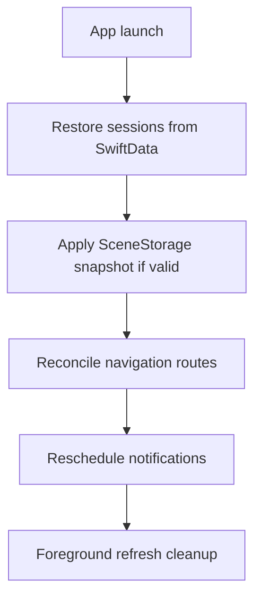

# 03 — Feature Walkthrough

## Dashboard

**Purpose:** Home screen — mood, active session, priority tasks, motivation.

| Role | Files |
|------|-------|
| View | `Features/Dashboard/DashboardView.swift`, `DashboardContentView.swift` |
| ViewModel | `DashboardViewModel.swift` |
| Orchestrator | `Orchestration/DashboardOrchestrator.swift` |
| Domain | `Domain/Dashboard/DashboardStateAggregator.swift`, `DashboardPriorityEngine.swift` |

**Flow:** `load()` → orchestrator fetches stats + tasks + reads session managers → aggregator builds `DashboardSnapshot` (mood, greeting, priorities).

**Business logic:**
- `DashboardPriorityEngine` scores tasks (in-progress, priority, milestones, deadline urgency); max 5 items
- Mood: `.activeFocus` when session running; `.recovery` evening fallback

**Edge cases:**
- `onSessionContinuityChanged()` keeps prior snapshot on refresh failure
- Pause/resume via orchestrator → session managers; errors surface as `sessionActionError`
- Deep links: `DashboardRoute.weeklyOverview` redirects to Statistics tab

---

## Focus Timer

**Deep dive:** [18 — Timer Architecture](18-timer-architecture.md)

**Purpose:** Timed focus sessions with optional task association.

| Role | Files |
|------|-------|
| Tab shell | `Features/Focus/FocusView.swift` |
| Start | `Start/FocusTimerStartView.swift`, `FocusTimerStartViewModel.swift` |
| Active | `Active/FocusTimerView.swift`, `FocusTimerViewModel.swift` |
| Manager | `Managers/FocusSessionManager.swift` (delegates to `SessionLifecycleRunner`) |
| Shared lifecycle | `Core/Timer/SessionLifecycleRunner.swift` |
| Restoration | `Restoration/FocusTimerRestorationModifier.swift`, `TimerRestorationManager.swift` |

**Flow:**
1. Setup → pick duration (`FocusDurationPreset`: 15/30/60 min), optional task, title
2. `startSession()` → persist, start `TimerEngine`, audio, Live Activity
3. 1s tick loop (only when `scenePhase == .active`)
4. Complete → notification, clear session, optional "Take Rest" navigation

**Edge cases:**
- `sessionAlreadyActive` if start while session exists
- `tick()` auto-completes when duration reached (persisted — critical bug fix)
- Back navigation locked during active lifecycle; tab bar hidden
- `FocusRoute.history` is placeholder

---

## Rest Timer

**Purpose:** Calm break sessions (not a top-level tab — `FocusRoute.restSession`).

| Role | Files |
|------|-------|
| View | `Features/Rest/RestTimerView.swift` |
| ViewModel | `RestTimerViewModel.swift` |
| Manager | `Managers/RestSessionManager.swift` (delegates to `SessionLifecycleRunner`) |
| Shared lifecycle | `Core/Timer/SessionLifecycleRunner.swift` |

**Differences from Focus:**
- Default title "Rest Break"; ambient `.rest` sounds
- **No** session-completion notification
- Calm breathing animations (`CalmBreathingModifier`)
- Same timer/restoration patterns otherwise

---

## Tasks

**Purpose:** Task management with milestones and deadlines.

| Role | Files |
|------|-------|
| List | `TaskList/TaskListView.swift`, `TaskListViewModel.swift` |
| Create | `Form/CreateTaskView.swift`, `CreateTaskViewModel.swift` |
| Edit | `Edit/EditTaskView.swift`, `EditTaskViewModel.swift` |
| Detail | `Detail/TaskDetailView.swift`, `TaskDetailViewModel.swift` |
| Validation | `Domain/Tasks/TaskValidation.swift`, `CreateTaskFormValidation.swift` |
| Drafts | `Form/Restoration/FormDraftManager.swift` |

**Filters:** Today (todo + inProgress), Upcoming (todo), Completed.

**Flow:** Create → validate → `repository.create` → `TaskUpdateNotifier.post` → dashboard/list refresh + notification reschedule.

**Edge cases:**
- Milestones: all complete → task `.completed`; uncomplete on completed task → `.inProgress`
- Edit draft restored only if newer than `task.updatedAt` and &lt; 7 days old
- Deadline must be today or later
- Load handles cancellation and "Task not found"

---

## Statistics

**Purpose:** Weekly focus analytics and trends.

| Role | Files |
|------|-------|
| View | `StatisticsView.swift`, `StatisticsContentView.swift` |
| ViewModel | `StatisticsViewModel.swift` |
| Calculator | `Domain/Statistics/FocusAnalyticsCalculator.swift` |
| Repository | `Data/Repositories/StatisticsRepositoryImpl.swift` |

**Flow:** `load()` → `fetchAnalytics()` → cards + charts (`WeeklyChartView`, streak, distribution).

**Edge cases:** Empty state when no sessions; failed load shows retry via pull-to-refresh; detail routes are placeholders.

---

## Notifications

**Purpose:** Local reminders — session done, deadlines, daily motivation, focus nudge.

| Role | Files |
|------|-------|
| Settings UI | `Notifications/Settings/NotificationSettingsView.swift` |
| Permission | `Permission/NotificationPermissionView.swift` |
| Scheduler | `Core/Notifications/NotificationScheduler.swift` |
| Quiet hours | `Core/Notifications/QuietHoursManager.swift` |
| Deadlines | `Core/Notifications/TaskDeadlineReminderPlanner.swift` |

**Scheduled types:**
1. Session completion (on focus complete)
2. Task deadline (1h before end of deadline day)
3. Focus reminder (daily 10:30, repeating)
4. Daily motivation (daily 9:00, repeating)

**Edge cases:**
- `rescheduleAll()` cancels all if disabled or unauthorized
- Quiet hours defer to period end; midnight-spanning fallback for deadlines
- Permission education sheet on first launch

---

## Settings

**Purpose:** App configuration entry points.

| Role | Files |
|------|-------|
| Shell | `Settings/SettingsView.swift`, `SettingsHomeView.swift` |
| Appearance | `Appearance/AppearanceSettingsView.swift` (informational — follows system) |
| About | `About/AboutView.swift` |

No dedicated `SettingsViewModel` — notification VM created lazily in `.task`.

---

## Live Activities

**Purpose:** Lock Screen / Dynamic Island timer display.

| Role | Files |
|------|-------|
| Manager | `LiveActivities/Managers/LiveActivityManager.swift` |
| Mapping | `ActivityStateMapper.swift`, `ProgressCalculator.swift` |

Started on session start; synced on pause/resume; ended on complete/cancel. `NoOpLiveActivityManager` on non-iOS.

---

## Cross-Cutting: Cold Restore

**Deep dive:** [`16-app-restoration-coordinator.md`](16-app-restoration-coordinator.md)

**File:** `Core/AppLifecycle/AppRestorationCoordinator.swift`

**Order:**
1. `restoreOnLaunch()` from SwiftData (authoritative sessions)
2. Apply SceneStorage/UserDefaults timer snapshot (if same session ID, scene elapsed ≥ DB)
3. `reconcileNavigationWithSessions`
4. `notificationScheduler.rescheduleAll()`
5. `AppForegroundRefresh.perform`

**Expiration:** timer snapshots expire after 24h (`TimerRestorationManager.expirationInterval`).

