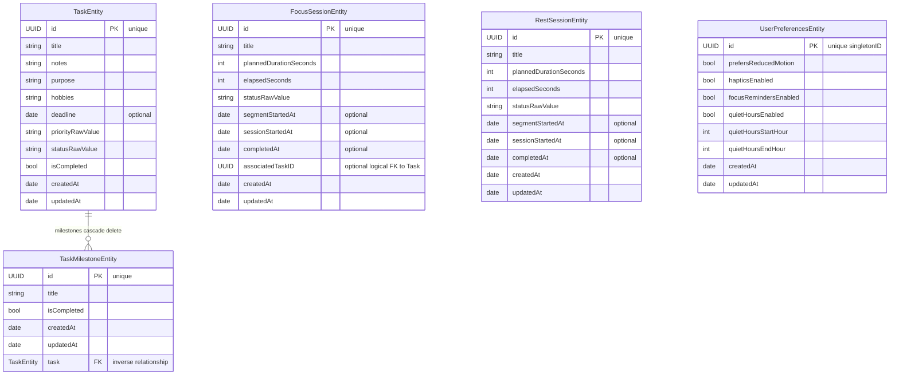
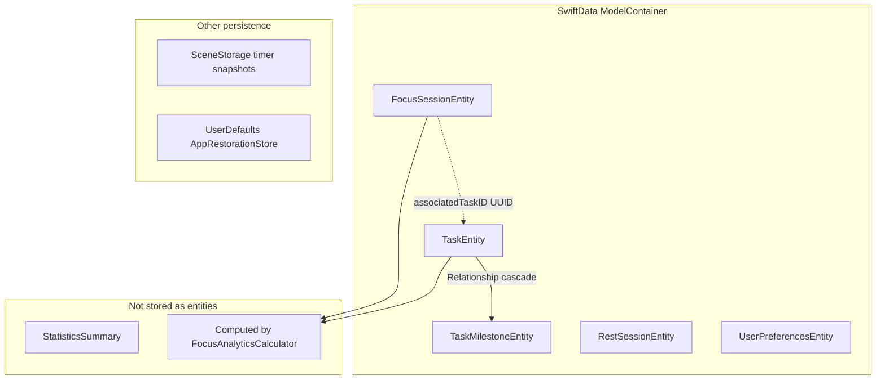
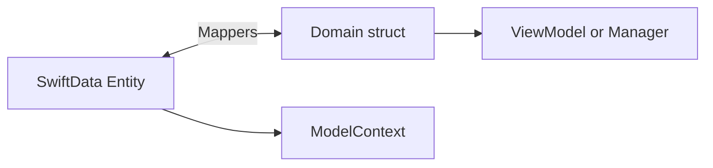
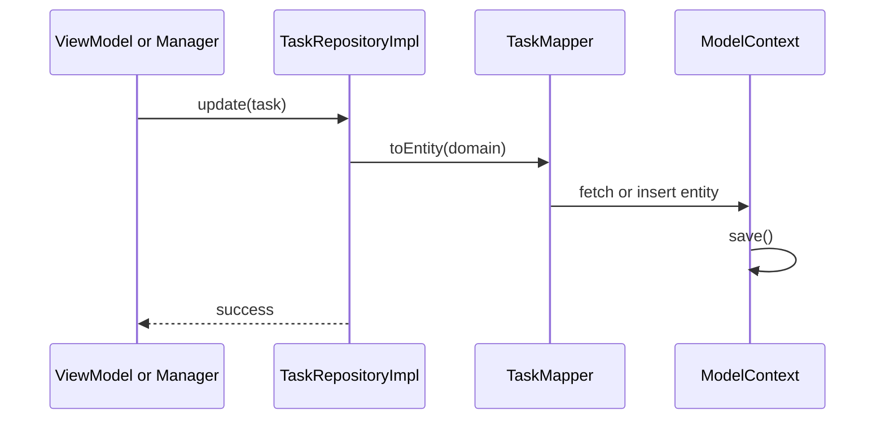

# 06 — Persistence

## Technology

**SwiftData** (not Core Data). Single `ModelContainer` owned by `PersistenceController`.

| File | Role |
|------|------|
| `Data/Persistence/PersistenceController.swift` | Container + `mainContext` |
| `Data/Persistence/PersistenceSchema.swift` | Schema registration |
| `Data/Persistence/Entities/*.swift` | `@Model` entities |
| `Data/Mappers/*.swift` | Entity ↔ domain mapping |
| `Data/Repositories/*Impl.swift` | CRUD via protocols |

Wired in `App/App.swift`: `.modelContainer(container.persistence.container)`.

---

## Data Models

### SwiftData Entities

| Entity | Domain type | Notes |
|--------|-------------|-------|
| `TaskEntity` | `Task` | Cascade to milestones |
| `TaskMilestoneEntity` | `TaskMilestone` | Child of task |
| `FocusSessionEntity` | `FocusSession` | Active + completed sessions |
| `RestSessionEntity` | `RestSession` | Rest sessions |
| `UserPreferencesEntity` | `UserPreferences` | Notifications, haptics, motion |

### Domain Layer

Pure `struct`/`enum` in `Domain/` — `Codable`, `Sendable`, `Equatable` where needed. **No SwiftData imports in Domain.**

---

## SwiftData schema diagram

Registered in [`PersistenceSchema.swift`](../../FocusUp/Data/Persistence/PersistenceSchema.swift) — **5 `@Model` types**, one `ModelContainer`, default on-disk store (or in-memory for tests/previews).

### Entity-relationship (high level)

`FocusSessionEntity`, `RestSessionEntity`, and `UserPreferencesEntity` have **no SwiftData relationships** to each other. Focus→Task is a **UUID reference** only (`associatedTaskID`).

### Visual map (how tables relate)

### Relationship rules

| From | To | Type | Notes |
|------|-----|------|-------|
| `TaskEntity` | `TaskMilestoneEntity` | **SwiftData `@Relationship`** | `deleteRule: .cascade` — deleting task deletes milestones |
| `FocusSessionEntity` | `TaskEntity` | **Logical only** | `associatedTaskID: UUID?` — no `@Relationship`; app resolves via `TaskRepository.fetch(id:)` |
| `RestSessionEntity` | — | **Standalone** | No task link |
| `UserPreferencesEntity` | — | **Singleton** | Fixed `UserPreferences.singletonID` — one preferences row |

### What is *not* in SwiftData

| Data | Where it lives |
|------|----------------|
| Statistics / charts | Computed at read time from `FocusSessionEntity` + `TaskEntity` |
| Active timer tick state | `TimerEngine` in memory + SceneStorage snapshot |
| Navigation state | SceneStorage + `AppRestorationStore` |
| Form drafts | SceneStorage / `FormDraftManager` |

### Domain mapping layer

Entities are **never** used in Features or ViewModels. Repositories map both ways:

Entity files: `FocusUp/Data/Persistence/Entities/`  
Mapper files: `FocusUp/Data/Mappers/`

---

## CRUD Flow

**Active session pattern:** `FocusRepository.fetchActive()` on launch; managers call `save()` on every pause/tick boundary.

**Statistics:** `StatisticsRepositoryImpl` reads focus sessions, runs `FocusAnalyticsCalculator`, caches summary until `invalidateCache()`.

---

## Migrations

**No explicit migration versioning** in MVP — schema is young. SwiftData lightweight migration assumed for additive changes.

**Risk for interview:** Production schema changes need `VersionedSchema` or migration plan before shipping breaking changes.

---

## Additional Persistence

| Store | Data | File |
|-------|------|------|
| SceneStorage | Timer snapshots, nav state | Restoration modifiers |
| UserDefaults | Backup restoration payloads | `AppRestorationStore` |
| In-memory drafts | Create/edit task forms | `FormDraftManager`, `EditDraftStore` |

---

## Error Handling

| Layer | Behavior |
|-------|----------|
| `PersistenceController.init` | `throws PersistenceError` |
| `PersistenceController.shared` | `fatalError` on failure — **weakness** |
| Repository methods | `async throws` to callers |
| ViewModels | Map to `.error(String)` or `lastError` |

---

## Why SwiftData + Repository?

| Benefit | Explanation |
|---------|-------------|
| Testability | Protocol repos + in-memory container in tests |
| Clean boundaries | Domain free of framework |
| Preview support | `PreviewTaskRepository` etc. |
| Future sync | Could swap Data layer without touching Domain |

**Alternative considered:** Core Data — more mature migrations, more boilerplate. SwiftData chosen for modern Swift API.

---

## Instances

| Instance | Use |
|----------|-----|
| `PersistenceController.shared` | Production |
| `.preview` | SwiftUI previews (in-memory + sample data) |
| `.testing` | Tests |
| `PersistenceController(inMemory: true)` | Unit tests |

---

## Key Files

- `Domain/Tasks/TaskRepository.swift` — protocol
- `Data/Repositories/TaskRepositoryImpl.swift` — implementation
- `Data/Mappers/TaskMapper.swift` — mapping
- `Data/Repositories/FocusRepositoryImpl.swift` — `fetchActive()` for restoration
