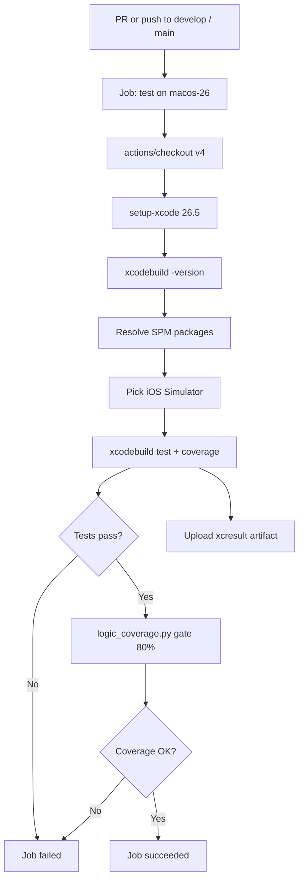

# 08 — CI/CD

## Active Workflow

**File:** `.github/workflows/ios-ci.yml` (in FocusUp git root)

**Legacy (unused if repo root is FocusUp/):** parent `.github/workflows/ios-ci.yml` — monorepo `iOS/` path.

**Android (separate):** `Android/.github/workflows/android-ci.yml`

---

## iOS CI — Purpose

Verify every change to `develop`/`main`: compile, unit tests, logic coverage ≥ 80%. **No deployment.**

---

## Trigger Conditions

```yaml
on:
  push:
    branches: [develop, main]
  pull_request:
    branches: [develop, main]
```

| Event | Runs? |
|-------|-----|
| PR → develop/main | ✅ (primary gate) |
| Push to develop/main | ✅ (post-merge safety) |
| Push to feature branch | ❌ (until PR opened) |

**Design:** One run per PR update — no duplicate push+PR on feature branches.

```yaml
concurrency:
  group: ios-ci-${{ github.workflow }}-${{ github.ref }}
  cancel-in-progress: true
```

---

## Execution Flow



Single job — no `needs`, no matrix.

---

## Step Breakdown

| Step | Action |
|------|--------|
| Checkout | `actions/checkout@v4` |
| Select Xcode | `maxim-lobanov/setup-xcode@v1` → **26.5** |
| Resolve packages | `xcodebuild -resolvePackageDependencies` |
| Pick simulator | Python + `simctl` — prefers iPhone 17 → 16 → 15 |
| Unit tests | `xcodebuild test -only-testing:FocusUpTests -enableCodeCoverage YES` |
| Coverage gate | `python3 scripts/logic_coverage.py` |
| Artifacts | `upload-artifact@v4` — `TestResults.xcresult` |

---

## Linting & Formatting

**iOS:** Not in CI. No SwiftLint/SwiftFormat workflow.

**Android CI:** `ktlintCheck`, `detekt` on `ubuntu-latest`.

---

## Coverage Reporting

- **Gate:** logic ≥ 80% (`scripts/coverage_policy.json`)
- **Report:** GitHub Step Summary markdown table from `logic_coverage.py`
- **Artifact:** full `.xcresult` for local Xcode inspection

---

## Configuration Rationale

| Choice | Why |
|--------|-----|
| `macos-26` | Xcode 26, iOS 26 simulators |
| Pin 26.5 | Match local; avoid concurrency CI drift |
| One job | Simple; adequate for single-app MVP |
| Skip UI tests | Template tests; slow/flaky |
| No SPM cache yet | Simplicity; room to optimize |
| No secrets | Nothing to sign/deploy |

---

## Android CI (Brief)

Path-filtered on `FocusUp/**` (Android module). JDK 17, Gradle cache, `./gradlew ktlintCheck detekt test`. No coverage gate, no deploy.

---

## Suggested Improvements

1. **Path filters** — skip CI on docs-only commits
2. **SPM cache** — `~/Library/Caches/org.swift.swiftpm`
3. **SwiftLint** — style + some concurrency lint
4. **`permissions: contents: read`**
5. **TestFlight workflow** — tag-triggered, Fastlane, secrets
6. **Dependabot** — Actions + SPM versions
7. **Delete stale** parent monorepo workflow

---

## Interview One-Liner

> "PRs to develop/main run a single macOS job: pinned Xcode 26.5, unit tests with Swift Testing, and an 80% logic-coverage gate that excludes SwiftUI views. No CD yet — verify only."
