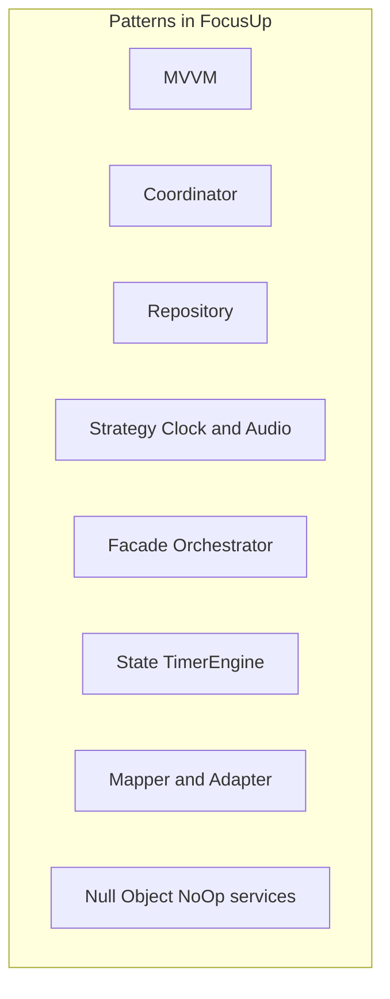

# 10 — Design Patterns

**Deep dives:** [`design-patterns/README.md`](design-patterns/README.md) — one file per pattern with diagrams and interview answers.

**Mermaid diagrams:** Use `flowchart` (one word, not `flow chart`). Avoid `@`, `>=`, and unquoted `/` or `+` in labels — quote node text with `["..."]` when needed. See fixes applied across this guide for GitHub/Cursor compatibility.

## MVVM

**Concept:** Separate UI (View) from presentation logic (ViewModel) and data (Model).

**Where:** Every feature — `TaskListView` + `TaskListViewModel` + `Task`.

**Deep dive:** [design-patterns/mvvm.md](design-patterns/mvvm.md)

**Why:** Testable logic; SwiftUI views stay declarative. ViewModels format strings and expose `loadingState`.

---

## MVVM-C (Coordinator)

**Concept:** Coordinators own navigation; ViewModels don't know about routes.

**Where:**
- `AppCoordinator`, `TabCoordinator<Route>`
- `AppCoordinator+TabNavigation.swift`

**Why:** Navigation survives refactoring; testable without UI (`AppCoordinatorNavigationTests`).

**Deep dive:** [design-patterns/mvvm-coordinator.md](design-patterns/mvvm-coordinator.md)

---

## Dependency Injection (Manual)

**Concept:** Dependencies passed in, not constructed inside types.

**Where:** `AppContainer`, initializer injection in ViewModels/managers.

**Why:** Swap real/preview/test implementations; explicit graph for interviews.

**Deep dive:** [design-patterns/dependency-injection.md](design-patterns/dependency-injection.md)

---

## Repository

**Concept:** Mediate between domain and data source behind a protocol.

**Where:**
- Protocols: `Domain/*/TaskRepository.swift`, etc.
- Impl: `Data/Repositories/*Impl.swift`
- Previews: `PreviewTaskRepository`

**Why:** Domain stays persistence-agnostic; in-memory tests.

**Deep dive:** [design-patterns/repository.md](design-patterns/repository.md)

---

## Factory

**Concept:** Centralized object creation.

**Where:**
- `AppContainer.live` / `.preview` / `.testing`
- `Repositories.live(using:)`, `.preview`
- `PersistenceController.shared` / `.preview`

**Why:** One place to wire the graph.

**Deep dive:** [design-patterns/factory.md](design-patterns/factory.md)

---

## Strategy

**Concept:** Interchangeable algorithms behind a protocol.

**Where:**
- `Clock` / `SystemClock` / `TestClock`
- `SessionAmbientSoundPlaying` / `SessionAmbientSoundPlayer` / `NoOp`
- `LiveActivityManaging` / `LiveActivityManager` / `NoOp`
- `NotificationService` / `NotificationServiceImpl` / `NoOp`

**Why:** Test doubles; platform variants (`#if canImport(ActivityKit)`).

**Deep dive:** [design-patterns/strategy.md](design-patterns/strategy.md)

---

## Observer (NotificationCenter)

**Concept:** Broadcast events to decoupled subscribers.

**Where:** `TaskUpdateNotifier.post(taskID:)` → `AppRootView` reschedules notifications.

**Why:** Tasks feature doesn't import notification scheduler directly.

**Deep dive:** [design-patterns/observer.md](design-patterns/observer.md)

---

## Facade

**Concept:** Simplified interface over subsystems.

**Where:**
- `DashboardOrchestrator` — hides multi-repo + session manager reads
- `NotificationScheduler` — wraps service + preferences + planning
- `AppRestorationCoordinator` — single cold-restore entry point

**Why:** Views/ViewModels call one type.

**Deep dive:** [design-patterns/facade.md](design-patterns/facade.md)

---

## State

**Concept:** Encapsulate state-specific behavior.

**Where:** `TimerEngine` + `TimerState` (idle/running/paused/completed/cancelled).

**Why:** Guards invalid transitions (`pause` only when running).

**Deep dive:** [design-patterns/state.md](design-patterns/state.md)

---

## Adapter / Mapper

**Concept:** Convert between incompatible interfaces.

**Where:** `Data/Mappers/TaskMapper`, `FocusSessionMapper`, etc.

**Why:** SwiftData entities ≠ domain structs.

**Deep dive:** [design-patterns/adapter-mapper.md](design-patterns/adapter-mapper.md)

---

## Decorator (ViewModifier)

**Concept:** Add behavior to views without subclassing.

**Where:** `NavigationRestorationModifier`, `CalmBreathingModifier`, `ActiveTimerTabBarVisibility`.

**Why:** Composable cross-cutting UI concerns.

**Deep dive:** [design-patterns/decorator.md](design-patterns/decorator.md)

---

## Builder (lightweight)

**Concept:** Step-by-step construction of complex objects.

**Where:** `DashboardStateAggregator.buildSnapshot()`, `FocusAnalyticsCalculator.buildStatisticsSummary()`.

**Why:** Pure functions assemble DTOs from parts.

**Deep dive:** [design-patterns/builder.md](design-patterns/builder.md)

---

## Singleton (limited)

**Concept:** One shared instance.

**Where:** `AppContainer.live`, `PersistenceController.shared`.

**Why:** App entry convenience. **Trade-off:** tests avoid singleton via fresh containers.

**Deep dive:** [design-patterns/singleton.md](design-patterns/singleton.md)

---

## Null Object

**Concept:** No-op implementation instead of nil checks.

**Where:** `NoOpNotificationService`, `NoOpSessionAmbientSoundPlayer`, `NoOpLiveActivityManager`.

**Why:** Previews/tests/production code paths stay uniform.

**Deep dive:** [design-patterns/null-object.md](design-patterns/null-object.md)

---

## SwiftUI-Specific Patterns

| Pattern | Where |
|---------|-------|
| Environment injection | `\.appContainer`, `\.hapticFeedback` |
| Composition root | `App.swift` + `AppRootView` |
| Lifted state | Coordinators own navigation `path` |
| Side-effect modifiers | Restoration on `scenePhase` |

**Deep dive:** [design-patterns/swiftui-patterns.md](design-patterns/swiftui-patterns.md)

---

## Pattern Map

---

## Interview Tip

Don't name-drop patterns without pointing to files: *"Repository pattern — `TaskRepository` protocol in Domain, `TaskRepositoryImpl` in Data, swapped in `AppContainer`."*
