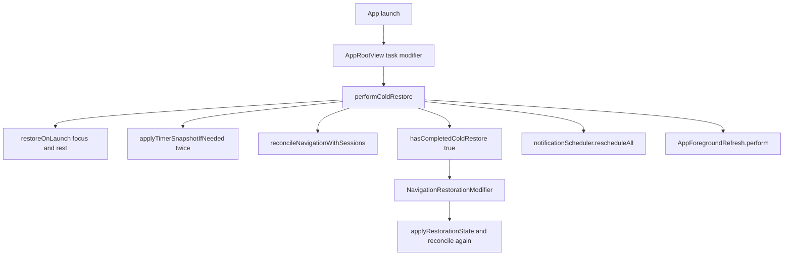
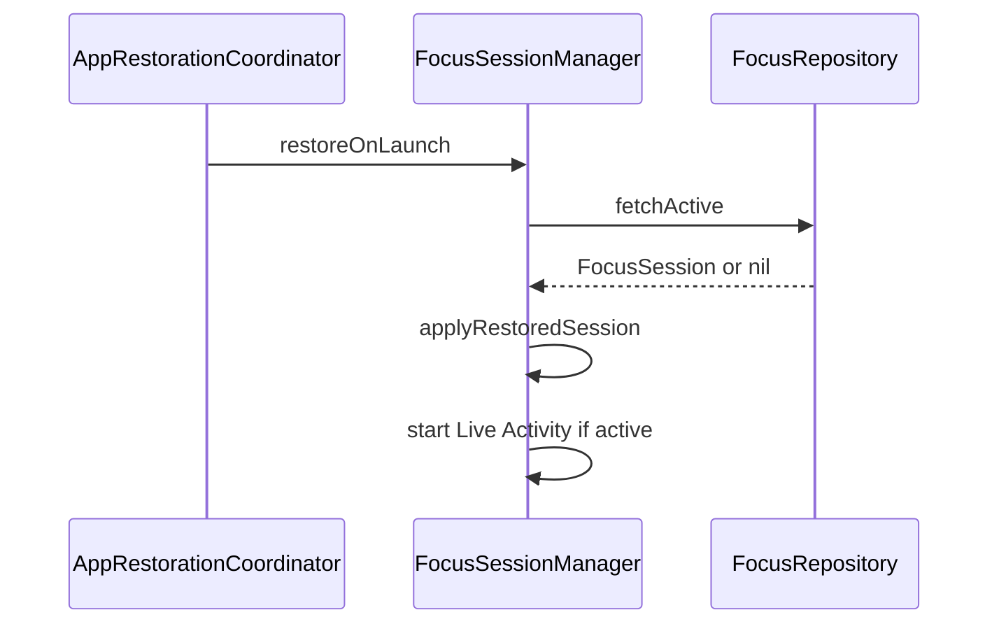
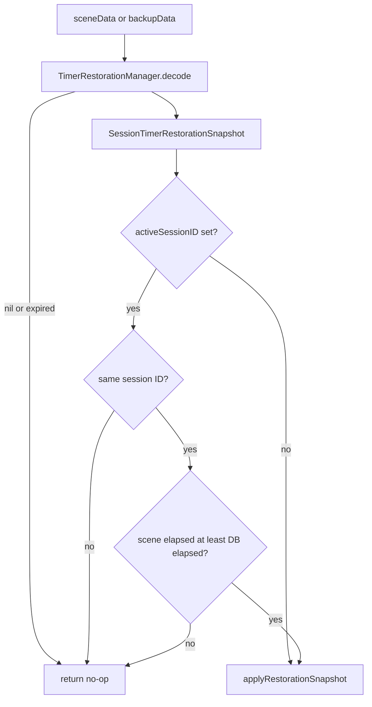
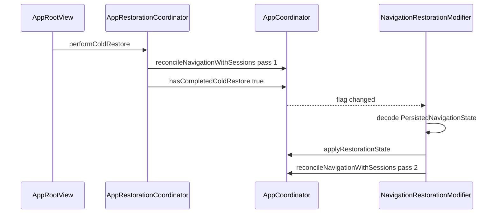
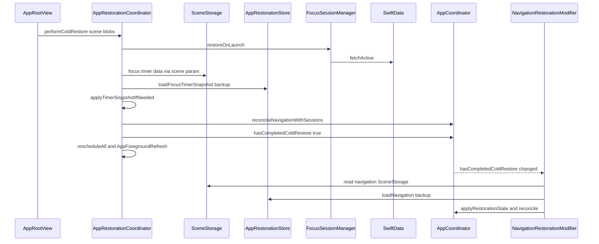

# 16 — AppRestorationCoordinator Deep Dive

**File:** [`Core/AppLifecycle/AppRestorationCoordinator.swift`](../../FocusUp/Core/AppLifecycle/AppRestorationCoordinator.swift)

**One-liner:** Single cold-restore pipeline that runs once at launch — SwiftData sessions first, timer snapshots second, navigation reconcile third, then notifications and foreground cleanup.

**Called from:** [`App/AppRootView.swift`](../../FocusUp/App/AppRootView.swift) → `performColdStart()` inside `.task { }`.

---

## Why this file exists

Without a coordinator, restoration would be scattered across SwiftUI modifiers with **undefined order**. That causes races:

- Navigation might restore before sessions exist
- Timer snapshots might overwrite a fresher DB state
- Foreground refresh might run on half-restored state

`AppRestorationCoordinator` enforces one ordered pipeline and a **`hasCompletedColdRestore` gate** so the rest of the app waits until cold restore finishes.

---

## Where it sits in the app



---

## Three storage layers

| Layer | What it stores | Authority | Written by |
|-------|----------------|-----------|------------|
| **SwiftData** | Active/completed sessions, persisted timer fields | **Highest** — source of truth for session lifecycle | Session managers on save |
| **SceneStorage** | Timer JSON, navigation JSON | Fast, per-scene | `*TimerRestorationModifier`, `NavigationRestorationModifier` |
| **UserDefaults** (`AppRestorationStore`) | Same payloads as backup | Fallback if scene storage lost | Same modifiers (dual-write) |

**Rule:** DB decides *whether* an active session exists. Scene/UserDefaults may refine *timer position* only if same session and not stale.

---

## What is a snapshot?

A **snapshot** is a plain, `Codable` value — a checkpoint of state at a point in time, not a live object.

| Type | File | Captures |
|------|------|----------|
| `TimerSnapshot` | `Core/Timer/TimerSnapshot.swift` | Timer state, duration config, elapsed segments, `segmentStartedAt` for wall-clock math |
| `SessionTimerRestorationSnapshot` | `Core/Timer/SessionTimerRestorationSnapshot.swift` | `sessionID` + `timerSnapshot` + `savedAt` (24h expiry) |
| `PersistedNavigationState` | `Core/Navigation/Restoration/PersistedNavigationState.swift` | Selected tab + each tab's navigation path |

**Wall-clock elapsed** (why snapshots work after force-quit):

```swift
// TimerSnapshot.elapsedSeconds(at:)
// running + segmentStartedAt → recompute elapsed from now - segmentStartedAt
```

Timer snapshots expire after **24 hours** (`TimerRestorationManager.expirationInterval`).

---

## Entry point: `AppRootView`

```swift
@SceneStorage(TimerRestorationKeys.focusTimerSnapshot) private var focusTimerSceneData: Data?
@SceneStorage(TimerRestorationKeys.restTimerSnapshot) private var restTimerSceneData: Data?

.task {
  await performColdStart()
}

private func performColdStart() async {
  await AppRestorationCoordinator.performColdRestore(
    using: container,
    scene: AppRestorationCoordinator.SceneSnapshots(
      focusTimerData: focusTimerSceneData,
      restTimerData: restTimerSceneData
    )
  )
  await syncMotionAndHapticPreferences()
}
```

`SceneSnapshots` bundles the timer blobs already bound via `@SceneStorage` on the root view. Navigation SceneStorage is **not** passed here — it is restored later in `NavigationRestorationModifier`.

**Other gates on `hasCompletedColdRestore` in `AppRootView`:**

- `onChange(scenePhase)` → foreground refresh only after cold restore
- `onReceive(TaskUpdateNotifier)` → reschedule notifications only after cold restore

---

## Line-by-line: `AppRestorationCoordinator`

### Lines 8–14 — Namespace and input bundle

```swift
@MainActor
enum AppRestorationCoordinator {
  struct SceneSnapshots {
    var focusTimerData: Data?
    var restTimerData: Data?
  }
```

| Line | Meaning |
|------|---------|
| 8 | Doc: order is sessions → timers → navigation reconcile |
| 9 | MainActor — touches session managers and coordinator |
| 10 | `enum` with no cases = namespace for static methods (no instances) |
| 11–14 | Bundles timer `Data?` from SceneStorage for focus and rest |

---

### Lines 16–20 — Idempotent entry guard

```swift
static func performColdRestore(using container: AppContainer, scene: SceneSnapshots) async {
  guard !container.coordinator.hasCompletedColdRestore else { return }
```

- Needs full `AppContainer` (managers, repos, scheduler, coordinator)
- **Run-once guard** — second call is a no-op (tested in `AppRestorationCoordinatorTests.coldRestoreIsIdempotentForProcess`)

---

### Step 1 — Lines 22–24: SwiftData is authoritative

```swift
await container.focusSessionManager.restoreOnLaunch()
await container.restSessionManager.restoreOnLaunch()
```

**`restoreOnLaunch()` (focus example):**

1. Skip if `activeSession` already in memory
2. `repository.fetchActive()` from SwiftData
3. `applyRestoredSession(session)` — in-memory session + timer baseline
4. Restart Live Activity if needed

**Why first:** SceneStorage may be empty, stale, or from a different session. DB decides session existence.



---

### Step 2 — Lines 26–36: Refine timers from scene or backup

```swift
await applyTimerSnapshotIfNeeded(
  manager: container.focusSessionManager,
  sceneData: scene.focusTimerData,
  backupData: AppRestorationStore.loadFocusTimerSnapshot()
)
// same for restSessionManager + rest timer keys
```

| Detail | Behavior |
|--------|----------|
| Priority | `sceneData ?? backupData` — SceneStorage first, UserDefaults fallback |
| Timing | **Never before** step 1 — manager must have DB-restored state first |
| Writers | `FocusTimerRestorationModifier` / `RestTimerRestorationModifier` on background |

---

### Step 3 — Lines 38–42: First navigation reconcile

```swift
container.coordinator.reconcileNavigationWithSessions(
  focusManager: container.focusSessionManager,
  restManager: container.restSessionManager
)
```

**Not full navigation restore** — that happens in `NavigationRestorationModifier` after the flag flips.

This pass **aligns routes with live session state now:**

- Active focus + on focus tab → push `.activeSession` if missing
- No active focus → `clearStaleFocusSessionRoutes`
- Same pattern for rest → `.restSession`

See [`AppCoordinator+RestorationReconciliation.swift`](../../FocusUp/Core/Navigation/AppCoordinator+RestorationReconciliation.swift).

---

### Lines 44–47: Open the gate + housekeeping

```swift
container.coordinator.hasCompletedColdRestore = true
await container.notificationScheduler.rescheduleAll()
await AppForegroundRefresh.perform(using: container)
```

| Line | Meaning |
|------|---------|
| 44 | **Gate opens** — navigation modifier, foreground handlers, task-update notifications proceed |
| 46 | Rebuild local notification schedule from tasks + preferences |
| 47 | Clear stale nav routes, dismiss orphan Live Activities, reschedule (again inside perform) |

---

## Line-by-line: `applyTimerSnapshotIfNeeded`

```swift
private static func applyTimerSnapshotIfNeeded<Manager>(
  manager: Manager,
  sceneData: Data?,
  backupData: Data?
) async where Manager: SessionTimerRestoring
```

Generic helper — one code path for focus and rest via `SessionTimerRestoring`.

### Decode (lines 55–56)

```swift
let data = sceneData ?? backupData
guard let snapshot = TimerRestorationManager.decode(data) else { return }
```

Returns `nil` if: no data, invalid JSON, or snapshot older than 24h.

### Safety checks (lines 58–63)

```swift
if let activeID = manager.activeSessionID {
  guard activeID == snapshot.sessionID else { return }
  let currentElapsed = manager.timerElapsedSeconds
  let sceneElapsed = snapshot.timerSnapshot.elapsedSeconds(at: .now)
  guard sceneElapsed >= currentElapsed else { return }
}
await manager.applyRestorationSnapshot(snapshot)
```

| Case | Behavior |
|------|----------|
| Manager has active session (from step 1) | Snapshot must match **same** `sessionID`; scene elapsed must be **≥** DB elapsed — never roll timer backward |
| No active session in manager | Skip `if` block → call `applyRestorationSnapshot` directly; manager still validates session in DB |



### What `applyRestorationSnapshot` does (manager side)

1. `TimerRestorationManager.reconcile(snapshot, at: now)` — adjust for time passed; auto-complete if timer expired while app was dead
2. Fetch session by ID from repository
3. Guard `session.status.isActiveLifecycle`
4. If snapshot state is completed/cancelled → finalize in DB, do **not** reactivate UI
5. Else → set `activeSession`, `timerEngine.restore`, persist, sync ambient sound + Live Activity

---

## `SessionTimerRestoring` protocol (lines 69–85)

```swift
@MainActor
protocol SessionTimerRestoring: AnyObject {
  var activeSessionID: UUID? { get }
  var timerElapsedSeconds: Int { get }
  func applyRestorationSnapshot(_ snapshot: SessionTimerRestorationSnapshot) async
}
```

Exposes only what the coordinator needs for generic timer restore. `FocusSessionManager` and `RestSessionManager` conform via extensions and delegate `restoreOnLaunch` / `applyRestorationSnapshot` to **`SessionLifecycleRunner`** — no duplicate restore logic in the coordinator or between managers.

---

## Two-phase navigation restore

Navigation uses **two reconcile passes** by design:

| Phase | When | What |
|-------|------|------|
| **1** | Inside `performColdRestore` (before flag) | Align routes with session managers after DB + timer restore |
| **2** | `NavigationRestorationModifier.restoreIfNeeded` (after flag) | Decode SceneStorage/UserDefaults nav state → `applyRestorationState` → reconcile again |

`NavigationRestorationModifier` watches `hasCompletedColdRestore`:

```swift
.onChange(of: container.coordinator.hasCompletedColdRestore) { _, isComplete in
  guard isComplete else { return }
  restoreIfNeeded()
}
```

**Why two phases:** Session state must be correct before applying saved tab/paths; saved paths may reference screens that are invalid without an active session.



---

## Full cold-start timeline



---

## Related files (study map)

| File | Role |
|------|------|
| `App/AppRootView.swift` | Triggers cold restore; SceneStorage bindings; scene-phase gates |
| `Core/AppLifecycle/AppRestorationStore.swift` | UserDefaults backup for nav + timer snapshots |
| `Core/Timer/TimerRestorationManager.swift` | Encode/decode + reconcile + 24h expiry |
| `Core/Timer/TimerSnapshot.swift` | Wall-clock timer checkpoint |
| `Core/Timer/SessionTimerRestorationSnapshot.swift` | Session ID + timer + savedAt |
| `Features/Focus/Restoration/FocusTimerRestorationModifier.swift` | Persist focus timer on background |
| `Features/Rest/Restoration/RestTimerRestorationModifier.swift` | Persist rest timer on background |
| `Core/Navigation/Restoration/NavigationRestorationModifier.swift` | Persist/restore navigation after flag |
| `Core/Navigation/AppCoordinator+RestorationReconciliation.swift` | Route alignment with sessions |
| `Features/Focus/Managers/FocusSessionManager.swift` | Delegates to runner; `restoreOnLaunch`, `applyRestorationSnapshot` |
| `Features/Rest/Managers/RestSessionManager.swift` | Same for rest |
| `Core/Timer/SessionLifecycleRunner.swift` | Shared restore/tick/persist pipeline |
| `Core/AppLifecycle/AppForegroundRefresh.swift` | Post-restore cleanup on foreground |

---

## Tests

**File:** [`FocusUpTests/Core/AppRestorationCoordinatorTests.swift`](../../FocusUpTests/Core/AppRestorationCoordinatorTests.swift)

| Test | Asserts |
|------|---------|
| `coldRestoreLoadsActiveSessionFromDatabase` | DB active session → manager restored, flag set |
| `coldRestoreIsIdempotentForProcess` | Second `performColdRestore` is safe |
| `reconcileAddsActiveSessionRouteOnFocusTab` | Active focus → `.activeSession` on focus path |
| `navigationBackupSurvivesForceQuitStyleReload` | `AppRestorationStore` round-trip |

Also see `FocusUpTests/Focus/RestorationIntegrationTests.swift` for end-to-end timer restore.

---

## Design principles (interview bullets)

1. **Single pipeline** — one place defines cold-restore order; avoids modifier races
2. **SwiftData wins** on session existence; scene wins on timer only if same session and elapsed ≥ DB
3. **Idempotent** — `hasCompletedColdRestore` guard
4. **Two-phase navigation** — session reconcile before flag; full SceneStorage nav after flag
5. **Generic timer helper** — DRY for focus/rest via `SessionTimerRestoring`
6. **Gate pattern** — foreground refresh and notifications wait for complete restore

---

## 60-second interview answer

> On launch, `AppRootView` calls `AppRestorationCoordinator.performColdRestore` once. First we restore active focus and rest sessions from SwiftData — that's authoritative. Then we optionally refine timer position from SceneStorage or a UserDefaults backup, but only if the snapshot matches the same session ID and has at least as much elapsed time as the DB restore, so we never roll the clock backward. We reconcile navigation with session state, set `hasCompletedColdRestore`, reschedule notifications, and run foreground cleanup. Full navigation stack restore from SceneStorage happens in a modifier that waits for that flag. Timer snapshots use wall-clock math and expire after 24 hours.

---

## Common interview questions

**Q: Why not restore everything in SwiftUI modifiers?**  
A: Modifiers persist on background but run independently. Without a coordinator, restore order is undefined and you get races between DB, timers, and navigation.

**Q: Why two navigation reconciles?**  
A: First pass syncs routes with session state after DB/timer restore. Second pass applies saved tab/paths from SceneStorage, then reconciles again so stale routes are cleared.

**Q: What if the scene snapshot is for a completed session?**  
A: `applyRestorationSnapshot` finalizes the session in DB and returns without setting `activeSession` — no ghost timer UI.

**Q: What if the user force-quits mid-focus?**  
A: SwiftData has the active session; SceneStorage may have a fresher timer tick. Coordinator merges with guards; on next foreground the tick loop resumes.

**Q: Why `try?` in restoration paths?**  
A: Intentional resilience — a bad snapshot or missing row should not crash launch. Trade-off: silent failures are harder to debug (see `14-project-review.md`).

**Q: SceneStorage vs UserDefaults?**  
A: SceneStorage is fast and scene-scoped. UserDefaults (`AppRestorationStore`) survives cases where scene storage is lost — dual-write on persist.

---

## Line map cheat sheet

| Lines | Responsibility |
|-------|----------------|
| 10–14 | Namespace + `SceneSnapshots` input bundle |
| 16–20 | Public API + run-once guard |
| 22–24 | Step 1: DB restore |
| 26–36 | Step 2: Scene/backup timer refine |
| 38–42 | Step 3: Nav reconcile (pre-flag) |
| 44 | Enable rest of app |
| 46–47 | Notifications + foreground cleanup |
| 50–66 | Timer snapshot decode + safety + apply |
| 71–85 | `SessionTimerRestoring` protocol + conformances |

---

## See also

- [`03-features.md`](03-features.md) — Cross-cutting cold restore summary
- [`06-persistence.md`](06-persistence.md) — SwiftData + restoration storage diagram
- [`05-concurrency.md`](05-concurrency.md) — async cold restore pipeline
- [`10-design-patterns.md`](10-design-patterns.md) — Coordinator / Facade for restore
- [`13-interview-questions.md`](13-interview-questions.md) — restoration Q&A
- [`14-project-review.md`](14-project-review.md) — `try?` and layered restore trade-offs
