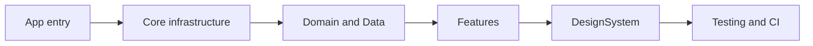

# 17 — Xcode Walkthrough Presentation Guide

Use this script when you **open FocusUp in Xcode** and walk interviewers through folders and files while talking about the project.

**Goal:** Show you understand architecture, trade-offs, and where code lives — not read every file line by line.

**Suggested duration:** 15–25 minutes (core path ~18 min). Leave 5–10 min for questions.

**Project to open:** `FocusUp/FocusUp.xcodeproj`  
**Scheme:** `FocusUp` (app) · optionally show `FocusUpTests`  
**Related docs:** [01-project-overview.md](01-project-overview.md) · [15-cheat-sheet.md](15-cheat-sheet.md)

---

## Before you start (5-minute prep)

### Xcode setup

- [ ] Open `FocusUp.xcodeproj`
- [ ] Project Navigator (`⌘1`) — expand **FocusUp** target source group
- [ ] Optional second editor: pin `AppContainer.swift` on the right
- [ ] Build once (`⌘B`) so indexing is warm
- [ ] Simulator or device ready if they ask for a quick demo
- [ ] Collapse noisy groups: `Assets.xcassets`, `Sounds`, `AppIcon.icon`

### Files to bookmark (open tabs in order)

1. `App/App.swift`
2. `Core/DependencyInjection/AppContainer.swift`
3. `App/AppRootView.swift`
4. `Features/Tasks/TaskList/TaskListViewModel.swift`
5. `Features/Focus/Managers/FocusSessionManager.swift`
6. `Core/Timer/TimerEngine.swift`
7. `Core/AppLifecycle/AppRestorationCoordinator.swift`
8. `.github/workflows/ios-ci.yml` (in project root, not inside app target)

### Opening line (30 seconds)

> “FocusUp is an offline-first iOS focus app — tasks, Pomodoro-style timers, rest breaks, dashboard, and local notifications. No backend. I organized the codebase by **layer and feature** so domain logic stays testable and UI stays thin. I’ll start at the app entry point, then DI, a representative feature flow, timers and restoration, and finish with tests and CI.”

---

## Presentation map (high level)



| Stop | Time | Message |
|------|------|---------|
| 1. App | 2 min | Where the app boots |
| 2. Core | 5 min | Shared engine: DI, nav, timer, lifecycle |
| 3. Domain + Data | 4 min | Clean boundaries, SwiftData |
| 4. Features | 6 min | MVVM-C in practice |
| 5. DesignSystem | 2 min | Consistent calm UI |
| 6. Testing + CI | 3 min | Quality gates |
| 7. Close | 1 min | Weakness + roadmap |

---

## Stop 1 — `App/` (~2 min)

**Expand in Xcode:** `FocusUp/App/`

| File | What to say |
|------|-------------|
| `App.swift` | “`@main` entry. Creates `AppContainer.live`, attaches SwiftData `modelContainer`, injects `\.appContainer` into the view tree. This is the **composition root**.” |
| `AppRootView.swift` | “Scene root: tab shell, cold restore on `.task`, scene-phase handling, restoration modifiers for timers. Sets `hapticsEnabled` from user preferences after restore.” |
| `RootTabView.swift` | “Five tabs — Dashboard, Tasks, Focus, Statistics, Settings. Binds to `AppCoordinator.selectedTab`.” |

**Open:** `App.swift` → point at:

```swift
AppRootView()
  .appContainer(container)
.modelContainer(container.persistence.container)
```

**If they ask “where does navigation start?”** → `RootTabView` + `AppCoordinator` (preview in Stop 2).

---

## Stop 2 — `Core/` (~5 min)

**Expand:** `FocusUp/Core/`

> “Core is **shared infrastructure** — not feature UI. Anything multiple features need lives here.”

### 2a. `Core/DependencyInjection/` (~1.5 min)

| File | What to say |
|------|-------------|
| `AppContainer.swift` | “Manual DI — no third-party container. Wires persistence, repos, session managers, notifications, haptics, Live Activities. `.live` / `.preview` / `.testing` factories.” |
| `AppContainer+Repositories.swift` | “Abstract factory for five repositories sharing one `ModelContext`.” |

**Open:** `AppContainer.swift` — scroll `init` and show `focusSessionManager` / `restSessionManager` wiring.

**Pattern callout:** Factory + Dependency Injection ([design-patterns/factory.md](design-patterns/factory.md)).

### 2b. `Core/Navigation/` (~1 min)

| File | What to say |
|------|-------------|
| `AppCoordinator.swift` | “Owns tab selection and per-tab `NavigationPath`. MVVM-**C** — ViewModels don’t push routes.” |
| `TabCoordinator.swift` | “Generic coordinator per tab: `TabCoordinator<FocusRoute>`.” |
| `Routes/*.swift` | “Typed, `Codable` routes for deep links and SceneStorage restoration.” |
| `Restoration/NavigationRestorationModifier.swift` | “Persists nav on background; restores after cold start flag.” |

**Open:** `AppCoordinator.swift` — mention `hasCompletedColdRestore` gate.

### 2c. `Core/Timer/` (~1 min)

| File | What to say |
|------|-------------|
| `TimerEngine.swift` | “State machine: idle/running/paused/completed. **Wall-clock** elapsed — not `Timer.publish` — so backgrounding is accurate.” |
| `TimerSnapshot.swift` | “Restoration-safe snapshot with `segmentStartedAt`.” |
| `Clock.swift` | “Strategy pattern — `SystemClock` in prod, `TestClock` in tests.” |

**Open:** `TimerEngine.swift` — show `pause` guard on `.running`.

### 2d. `Core/AppLifecycle/` (~1 min)

| File | What to say |
|------|-------------|
| `AppRestorationCoordinator.swift` | “**Single cold-restore pipeline**: SwiftData sessions → timer snapshots → nav reconcile → notifications. See [16-app-restoration-coordinator.md](16-app-restoration-coordinator.md).” |
| `AppRestorationStore.swift` | “UserDefaults backup when SceneStorage is lost.” |
| `AppForegroundRefresh.swift` | “Foreground cleanup: stale routes, Live Activities.” |

### 2e. Other Core folders (brief)

| Folder | One line |
|--------|----------|
| `Core/Notifications/` | `NotificationScheduler` facade over UNUserNotificationCenter + task deadlines |
| `Core/Audio/` | Ambient sound protocol + player; `NoOp` for previews |
| `Core/Feedback/` | `HapticFeedbackCoordinator` — UIKit haptics behind environment |
| `Core/Responsive/` | Size-class helpers for iPad / readable width |

---

## Stop 3 — `Domain/` + `Data/` (~4 min)

> “Domain has **no SwiftUI, no SwiftData**. Data implements persistence behind protocols.”

### 3a. `Domain/` (~2 min)

**Expand:** `Domain/Tasks/`, `Domain/Focus/`, `Domain/Statistics/`

| File / area | What to say |
|-------------|-------------|
| `Domain/Tasks/Task.swift` | “Pure struct — milestones, status, validation-friendly.” |
| `Domain/Tasks/TaskRepository.swift` | “Protocol the feature depends on. ViewModels never import SwiftData.” |
| `Domain/Statistics/FocusAnalyticsCalculator.swift` | “Pure stats math — easy to unit test.” |
| `Domain/Dashboard/DashboardStateAggregator.swift` | “Builder-style snapshot from stats + tasks + active session.” |

**Note:** Domain type is `Task` — that’s why UI uses `_Concurrency.Task` for async work.

### 3b. `Data/` (~2 min)

**Expand:** `Data/Persistence/`, `Data/Repositories/`, `Data/Mappers/`

| File / area | What to say |
|-------------|-------------|
| `PersistenceController.swift` | “Owns `ModelContainer` + `mainContext`. `.shared` / `.preview` / in-memory for tests.” |
| `PersistenceSchema.swift` | “Five `@Model` entities registered once.” |
| `Entities/*.swift` | “SwiftData entities — storage shape, not UI shape.” |
| `Mappers/TaskMapper.swift` | “Adapter: `TaskEntity` ↔ `Task`.” |
| `Repositories/TaskRepositoryImpl.swift` | “`FetchDescriptor`, map to domain, save.” |
| `Repositories/Preview/` | “Stub data for SwiftUI previews.” |

**Open:** `TaskRepositoryImpl.swift` — `fetchAll()` + `TaskMapper.toDomain`.

**If they ask about schema:** open `PersistenceSchema.swift` and name the five entities (Task, Milestone, FocusSession, RestSession, UserPreferences).

---

## Stop 4 — `Features/` (~6 min)

> “Features are **vertical slices** — UI + ViewModels + feature-specific managers. This is what users experience.”

Walk **one happy path** (Tasks) then **one complex path** (Focus).

### 4a. `Features/Tasks/` (~2.5 min)

| Path | What to say |
|------|-------------|
| `TasksView.swift` | “Feature root — `FeatureNavigationShell`, creates `TaskListViewModel` with injected repo.” |
| `TaskList/TaskListViewModel.swift` | “MVVM: loads via `repository.fetchAll()`, filters Today/Upcoming/Completed, exposes `TaskListViewState`.” |
| `TaskList/TaskListView.swift` | “`LazyVGrid` via `AdaptiveGrid` — lazy rendering. Pull to refresh.” |
| `Form/CreateTaskView.swift` | “Create flow; posts `TaskUpdateNotifier` after save.” |
| `TaskUpdateNotifier.swift` | “Observer pattern — decouples Tasks from `NotificationScheduler`.” |

**Scaling talking point (if asked):** “Today `fetchAll()` is fine for MVP; I’d add filtered/paginated repository methods for large lists.”

### 4b. `Features/Focus/` + `Features/Rest/` (~2.5 min)

| Path | What to say |
|------|-------------|
| `Focus/Managers/FocusSessionManager.swift` | “**Application service** — not a ViewModel. Owns active session, `TimerEngine`, audio, Live Activity, persistence.” |
| `Focus/Active/FocusTimerViewModel.swift` | “Thin — formats time strings, delegates lifecycle to manager.” |
| `Focus/Active/FocusTimerView.swift` | “Timer UI; tick loop only when scene is active.” |
| `Focus/Restoration/FocusTimerRestorationModifier.swift` | “Writes timer snapshot on background; coordinator restores on launch.” |
| `Rest/Managers/RestSessionManager.swift` | “Same patterns as focus, simpler domain.” |
| `Rest/Animations/CalmBreathingModifier.swift` | “Rest-specific calm motion; respects Reduce Motion.” |

**Open:** `FocusSessionManager.swift` — `startSession`, `completeSession`, `restoreOnLaunch`.

### 4c. Other features (30 sec each)

| Feature | Highlight file |
|---------|----------------|
| **Dashboard** | `Dashboard/Orchestration/DashboardOrchestrator.swift` — parallel repo reads, facade |
| **Statistics** | `Statistics/StatisticsViewModel.swift` + `FocusAnalyticsCalculator` |
| **Notifications** | `Notifications/Settings/NotificationSettingsViewModel.swift` |
| **Live Activities** | `LiveActivities/Managers/LiveActivityManager.swift` |
| **Settings** | `Settings/SettingsView.swift` — mostly informational MVP |

---

## Stop 5 — `DesignSystem/` (~2 min)

> “Shared visual language — tokens and components so features don’t invent colors and spacing.”

| Folder | What to say |
|--------|-------------|
| `Theme/` | `AppColors`, `AppTypography`, `AppSpacing` |
| `Motion/FocusMotion.swift` | Global animation tokens; `nil` animation when reduced motion |
| `Styles/AppButtonStyles.swift` | Primary/secondary/destructive + haptics on press |
| `Layout/AdaptiveGrid.swift` | Responsive grid for task cards |
| `Cards/`, `Components/` | Reusable `AppCard`, form rows, etc. |

**Open:** `FocusMotion.swift` — mention accessibility (`focusMotionReduced` environment).

---

## Stop 6 — `Testing/` + test target + CI (~3 min)

### 6a. `FocusUp/Testing/` (inside app target)

> “Mocks and preview data compile into the **app target** so `#Preview` and `AppContainer.preview` work.”

| Folder | What to say |
|--------|-------------|
| `Testing/Mocks/` | `MockTaskRepository`, `TestClock`, `NoOp*` services |
| `Testing/Fixtures/` | `DomainFixtures` for tests and previews |

### 6b. `FocusUpTests/` (test target in Xcode)

**Expand test groups** — don’t enumerate every file:

| Group | What to say |
|-------|-------------|
| `FocusUpTests/Tasks/` | ViewModel + validation tests |
| `FocusUpTests/Timer/` | `TimerEngineTests` with `TestClock` |
| `FocusUpTests/Core/` | `AppRestorationCoordinatorTests` |
| `FocusUpTests/Persistence/` | Repository + mapper integration |
| `FocusUpTests/Notifications/` | Scheduler + planner |

**Framework:** Swift Testing (`@Test`, `#expect`). Cuckoo only for `Clock` code generation.

### 6c. CI (project root, not app folder)

**Open:** `FocusUp/.github/workflows/ios-ci.yml`

> “Single job on `macos-26`, Xcode 26.5, `xcodebuild test`, then `logic_coverage.py` enforces **80% logic coverage**. PRs to `main`/`develop` only — avoids duplicate runs.”

**Open:** `scripts/coverage_policy.json` — mention views/restoration modifiers excluded intentionally.

---

## Stop 7 — Close (~1 min)

### Strengths (pick 2)

- Layered restoration (SwiftData + SceneStorage + UserDefaults)
- Testable domain + timestamp timers
- Explicit DI graph in `AppContainer`
- CI logic-coverage gate

### One weakness (say proactively)

> “`PersistenceController.shared` still `fatalError`s on init failure — I’d replace that with recoverable error UI. No TestFlight/CD pipeline yet.”

See [14-project-review.md](14-project-review.md).

### Invite questions

> “I can go deeper on restoration, session lifecycle, notifications, or any feature folder.”

---

## Optional live demo (2–3 min)

If time allows, run the app and narrate:

1. **Tasks** → create a task (validation + save)
2. **Focus** → start timer → background app → return (restoration)
3. **Dashboard** → active session card

Keep Xcode open on `FocusSessionManager` or `AppRestorationCoordinator` while demo runs.

---

## Xcode navigation tips (during presentation)

| Action | Shortcut / tip |
|--------|----------------|
| Open quickly | `⌘⇧O` → type filename |
| Call hierarchy | Right-click symbol → Show Call Hierarchy |
| Find references | `⌘⇧F` in project |
| Collapse folders | Click arrows; start collapsed except current stop |
| Split editor | `⌘⌥↩` — code + architecture diagram on second monitor |

**Don’t:** Expand all 275 files. **Do:** Expand one folder at a time, then collapse.

---

## Branching: if they interrupt with…

| Question | Jump to |
|----------|---------|
| “How does DI work?” | `AppContainer.swift` + `AppContainer+Repositories.swift` |
| “How is navigation tested?” | `FocusUpTests/Navigation/` |
| “Force-quit recovery?” | `AppRestorationCoordinator.swift` + [16-app-restoration-coordinator.md](16-app-restoration-coordinator.md) |
| “Design patterns?” | [design-patterns/README.md](design-patterns/README.md) |
| “Large task lists?” | `TaskListViewModel.swift` — fetchAll today; repo pagination tomorrow |
| “Why no backend?” | MVP scope, privacy, offline-first |
| “MainActor?” | Project build setting + `@MainActor` on managers/repos |

---

## Folder cheat sheet (single slide in your head)

```
App/           → Boot + scene root
Core/          → DI, navigation, timer, notifications, lifecycle
Domain/        → Models, protocols, pure logic
Data/          → SwiftData, mappers, repository impls
Features/      → Screens, ViewModels, session managers
DesignSystem/  → Tokens, components, motion
Testing/       → Mocks/fixtures (in app target)
Sounds/        → Bundled ambient audio
FocusUpTests/  → Unit tests (separate target)
.github/       → CI workflow
scripts/       → Coverage gate
docs/          → Architecture + interview guide
```

---

## Timing variants

| Format | Path |
|--------|------|
| **10 min** | App → AppContainer → TaskListViewModel → FocusSessionManager → TimerEngine → CI |
| **18 min** | Full script Stops 1–7 |
| **30 min** | Full script + live demo + deep dive on restoration |

---

## Pre-presentation checklist (day before)

- [ ] Pull latest `develop` / your PR branch
- [ ] Run tests locally once (`⌘U` on FocusUp scheme)
- [ ] Read [15-cheat-sheet.md](15-cheat-sheet.md) once
- [ ] Skim [16-app-restoration-coordinator.md](16-app-restoration-coordinator.md)
- [ ] Charge laptop; disable notifications; light IDE theme
- [ ] Increase Xcode font size if screen-sharing (Preferences → Fonts & Colors)

---

## Related docs

| Doc | Use when |
|-----|----------|
| [01-project-overview.md](01-project-overview.md) | Big picture backup |
| [02-architecture.md](02-architecture.md) | Deeper architecture Q&A |
| [03-features.md](03-features.md) | Per-feature detail |
| [13-interview-questions.md](13-interview-questions.md) | Rapid Q&A |
| [14-project-review.md](14-project-review.md) | Honest weaknesses |
| [15-cheat-sheet.md](15-cheat-sheet.md) | Last-minute refresh |
