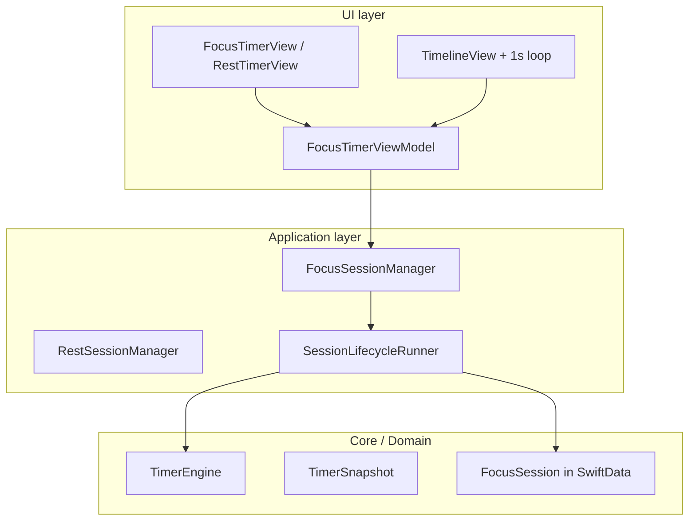
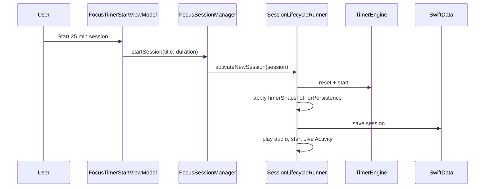

# 18 — Timer Architecture Deep Dive

**Core files:** [`Core/Timer/`](../../FocusUp/Core/Timer/) — `TimerEngine`, `TimerSnapshot`, `Clock`, `SessionLifecycleRunner`

**Session owners:** [`FocusSessionManager.swift`](../../FocusUp/Features/Focus/Managers/FocusSessionManager.swift), [`RestSessionManager.swift`](../../FocusUp/Features/Rest/Managers/RestSessionManager.swift)

**UI:** [`FocusTimerView.swift`](../../FocusUp/Features/Focus/Active/FocusTimerView.swift), [`RestTimerView.swift`](../../FocusUp/Features/Rest/RestTimerView.swift)

**Restoration:** [`AppRestorationCoordinator.swift`](../../FocusUp/Core/AppLifecycle/AppRestorationCoordinator.swift), [`FocusTimerRestorationModifier.swift`](../../FocusUp/Features/Focus/Restoration/FocusTimerRestorationModifier.swift), [`TimerRestorationManager.swift`](../../FocusUp/Features/Focus/Restoration/TimerRestorationManager.swift)

**One-liner:** Timers are timestamp-based (not tick-based): elapsed is computed from `segmentStartedAt` and `accumulatedElapsedSeconds`, so they stay accurate across background and restoration. `TimerEngine` owns the math; session managers own persistence and side effects via a shared `SessionLifecycleRunner`. The UI uses `TimelineView` for display and a 1-second async loop only to detect completion and persist.

**Related:** [16 — AppRestorationCoordinator](16-app-restoration-coordinator.md) · [03 — Feature Walkthrough (Focus/Rest)](03-features.md)

---

## Big picture: three layers

The timer is split into **engine**, **session**, and **UI** so each layer has one job:



| Layer | Type | Responsibility |
|-------|------|----------------|
| **TimerEngine** | Pure clock math | Running / paused / elapsed / remaining from timestamps |
| **FocusSession / RestSession** | Domain + SwiftData | Durable session record (title, status, elapsed segments) |
| **SessionManager** | Lifecycle owner | Start / pause / complete, persist, audio, Live Activity |
| **ViewModel + View** | Presentation | Display progress, handle taps, auto-complete detection |

---

## Core idea: timestamp-based elapsed, not a tick counter

A naive timer might do `elapsed += 1` every second. FocusUp does **not** do that as the source of truth.

`TimerSnapshot` stores:

- `accumulatedElapsedSeconds` — time from **finished** running segments
- `segmentStartedAt` — when the **current** running segment began (`nil` when paused)
- `state` — idle / running / paused / completed / cancelled
- `configuration.totalDurationSeconds` — planned length

Elapsed at any moment is computed from wall clock:

```swift
func elapsedSeconds(at date: Date) -> Int {
  guard state == .running, let segmentStartedAt else {
    return accumulatedElapsedSeconds
  }
  let segment = max(0, Int(date.timeIntervalSince(segmentStartedAt)))
  return accumulatedElapsedSeconds + segment
}
```

### Why this approach

1. **Survives backgrounding** — When the app is suspended, no ticks run, but `Date()` still advances. On return, `elapsedSeconds(at: .now)` is correct without “catching up” hundreds of ticks.
2. **Works with `TimelineView`** — SwiftUI passes `context.date` into the view. Progress is derived from that date, so the ring animates smoothly without a dedicated display timer.
3. **Restoration-friendly** — You persist a small snapshot (state + timestamps), not “we were at tick 847.”
4. **Testable** — `TestClock` advances time deterministically; no real `sleep` in unit tests.

**File:** [`Core/Timer/Clock.swift`](../../FocusUp/Core/Timer/Clock.swift)

---

## `TimerEngine`: state machine for timer math only

`TimerEngine` owns a `TimerSnapshot` and exposes lifecycle transitions:

| Action | What changes |
|--------|----------------|
| `start` | `state = .running`, `segmentStartedAt = now`, elapsed = 0 |
| `pause` | Fold current segment into `accumulatedElapsedSeconds`, clear `segmentStartedAt` |
| `resume` | New `segmentStartedAt`, keep accumulated |
| `complete` / `cancel` | Terminal state, freeze elapsed |
| `tick` | If running and `remaining <= 0`, auto-`complete` |

On pause, the engine folds the live segment into accumulated elapsed:

```swift
func pause(at date: Date? = nil) {
  guard snapshot.state == .running else { return }
  let now = date ?? clock.now()
  let accumulated = snapshot.elapsedSeconds(at: now)
  snapshot = TimerSnapshot(
    state: .paused,
    configuration: snapshot.configuration,
    accumulatedElapsedSeconds: accumulated,
    segmentStartedAt: nil,
    lastUpdatedAt: now
  )
}
```

**Why separate from session managers:** `TimerEngine` has no SwiftData, no audio, no notifications. It is a small, testable state machine. Session managers orchestrate engine + persistence + side effects.

**File:** [`Core/Timer/TimerEngine.swift`](../../FocusUp/Core/Timer/TimerEngine.swift)

---

## Dual state: engine vs session

There are two representations of “where the timer is”:

| | **TimerEngine** (in-memory) | **FocusSession** (SwiftData) |
|---|---|---|
| Purpose | Live, precise timer math | Durable app state |
| Updated | Every pause / resume / tick | On every lifecycle event |
| Sync | `applyTimerSnapshotForPersistence` | |

```swift
mutating func applyTimerSnapshotForPersistence(_ snapshot: TimerSnapshot, at date: Date = .now) {
  if snapshot.state == .running {
    elapsedSeconds = snapshot.accumulatedElapsedSeconds
    segmentStartedAt = snapshot.segmentStartedAt ?? date
  } else {
    elapsedSeconds = snapshot.elapsedSeconds(at: date)
    segmentStartedAt = nil
  }
  status = FocusSessionStatus.from(timerState: snapshot.state)
  updatedAt = date
}
```

**Why both?**

- **Engine** is optimized for display and tick logic (running segment math).
- **Session** is what survives process death via SwiftData and powers Dashboard, statistics, and restoration.
- On cold launch, DB restores the session → engine is **rebuilt** from session fields (`rebuildTimer` in `SessionLifecycleRunner`).

**Files:** [`Domain/Focus/FocusSession+Timing.swift`](../../FocusUp/Domain/Focus/FocusSession+Timing.swift), [`Domain/Rest/RestSession+Timing.swift`](../../FocusUp/Domain/Rest/RestSession+Timing.swift)

---

## Session lifecycle: `SessionLifecycleRunner`

Focus and rest timers share most of the same flow. That lives in `SessionLifecycleRunner`:

```swift
func activateNewSession(_ session: Session, durationSeconds: Int) async throws {
  timerEngine.reset(configuration: configuration)
  timerEngine.start(at: now)
  var mutable = session
  mutable.applyTimerSnapshotForPersistence(timerEngine.exportSnapshot(at: now), at: now)
  try await persist(mutable)
  await sideEffects.onAfterStart?(mutable, now)
}
```

Every transition follows the same template:

1. Mutate `TimerEngine`
2. Mirror into session via `applyTimerSnapshotForPersistence`
3. `save` to repository
4. Run side effects (audio, Live Activity, notifications)

**Why a generic runner + thin managers?**

- **DRY** — pause / resume / complete / cancel / tick / restore written once
- **Managers stay thin** — focus-only: `associatedTaskID`, completion notification, `.focus` audio; rest-only: `.rest` audio
- **Side effects as closures** — `SessionLifecycleSideEffects` avoids a fat base class
- **Testable** — runner tested with `FocusSession` + in-memory repo, no Live Activity

**Files:** [`SessionLifecycleRunner.swift`](../../FocusUp/Core/Timer/SessionLifecycleRunner.swift), [`SessionLifecycleSideEffects.swift`](../../FocusUp/Core/Timer/SessionLifecycleSideEffects.swift), [`TimedPersistableSession.swift`](../../FocusUp/Core/Timer/TimedPersistableSession.swift)

---

## How the UI displays time

Two mechanisms work together.

### 1. `TimelineView` for smooth display

```swift
TimelineView(.periodic(from: .now, by: 1)) { context in
  timerDisplay(at: context.date)
}
```

`viewModel.progress(at: date)` reads from `timerEngine` using `context.date`. The ring updates every second **without** storing elapsed in `@State`.

With Reduce Motion, it falls back to a static `.now` display.

### 2. Background loop for auto-complete + persistence

Display does not need to mutate state every second. But when the timer hits zero, the app must **complete the session** (save to DB, stop audio, end Live Activity).

```swift
private func runTimerLoop() async {
  guard viewModel.hasActiveSession else { return }
  while !_Concurrency.Task.isCancelled, viewModel.hasActiveSession {
    if scenePhase == .active {
      await viewModel.advanceTimerTick()
    }
    try? await _Concurrency.Task.sleep(for: .seconds(1))
  }
}
```

`SessionLifecycleRunner.tick()`:

```swift
func tick() async -> TimerSnapshot {
  let priorState = timerEngine.state
  let snapshot = timerEngine.tick(at: clock.now())
  if priorState != .completed, snapshot.state == .completed {
    try? await completeSession()
  }
  return snapshot
}
```

**Why split display vs tick?**

- **Display** = cheap, read-only, driven by `TimelineView` + timestamps
- **Tick** = side-effectful (complete session, persist, notify) — only when app is **active**
- Avoids writing to SwiftData every second
- Avoids using `Timer.scheduledTimer` (harder to test, lifecycle issues, not Swift concurrency–friendly)

**Note:** `_Concurrency.Task` is used because the domain type `struct Task` shadows Swift’s concurrency `Task`.

**Files:** [`FocusTimerView.swift`](../../FocusUp/Features/Focus/Active/FocusTimerView.swift), [`FocusTimerViewModel.swift`](../../FocusUp/Features/Focus/Active/FocusTimerViewModel.swift)

---

## Restoration: SwiftData first, SceneStorage second

Timers must survive app kill. FocusUp uses a **two-phase restore** (see also [16 — AppRestorationCoordinator](16-app-restoration-coordinator.md)):

```swift
// 1. Authoritative session state from SwiftData.
await container.focusSessionManager.restoreOnLaunch()
await container.restSessionManager.restoreOnLaunch()

// 2. Refine timers from scene or app-wide backup (never before DB restore).
await applyTimerSnapshotIfNeeded(manager: ..., sceneData: ..., backupData: ...)
```

| Source | Role |
|--------|------|
| **SwiftData** | Authoritative: session exists, status, elapsed, `segmentStartedAt` |
| **SceneStorage + `AppRestorationStore`** | Finer-grained timer snapshot if more recent |

Scene restore only applies if:

- Session IDs match
- Scene elapsed ≥ DB elapsed (never go backwards in time)

```swift
if let activeID = manager.activeSessionID {
  guard activeID == snapshot.sessionID else { return }
  let currentElapsed = manager.timerElapsedSeconds
  let sceneElapsed = snapshot.timerSnapshot.elapsedSeconds(at: .now)
  guard sceneElapsed >= currentElapsed else { return }
}
```

While running, `FocusTimerRestorationModifier` dual-writes on background:

- `@SceneStorage` (per-window)
- `AppRestorationStore` (app-wide backup)

**Why two stores?** SceneStorage is fast and scene-scoped; app-wide backup covers cases where scene data is missing. SwiftData remains the durable contract.

`TimerRestorationManager.reconcile` handles “timer expired while app was dead”:

```swift
if timer.state == .running {
  if timer.remainingSeconds(at: date) <= 0 {
    timer.state = .completed
    timer.accumulatedElapsedSeconds = timer.configuration.totalDurationSeconds
    timer.segmentStartedAt = nil
  }
}
```

Snapshots older than 24 hours are discarded.

---

## End-to-end: starting a focus session



User opens timer screen → `TimelineView` shows live progress → 1s loop calls `tick()` → at zero, `completeSession()` runs full teardown.

---

## Pause → background → relaunch (field-level mental model)

| Step | TimerEngine | FocusSession (DB) |
|------|-------------|-------------------|
| Running 8 min into 25 min | `accumulated=0`, `segmentStartedAt=T0`, state=running | `elapsedSeconds=0`, `segmentStartedAt=T0`, status=active |
| User pauses at 10 min | `accumulated=600`, `segmentStartedAt=nil`, state=paused | `elapsedSeconds=600`, `segmentStartedAt=nil`, status=paused |
| App backgrounds | SceneStorage saves timer JSON | Unchanged (last save on pause) |
| Force quit + relaunch | Rebuilt from DB via `rebuildTimer` | `restoreOnLaunch` loads active row |
| Scene refine (if newer) | `restore` + `reconcileAfterRestore` | Updated if scene elapsed ≥ DB |

If the app was dead past the planned end, `reconcile` marks the timer completed before UI renders.

---

## Design decisions summary

| Decision | Alternative considered | Why FocusUp chose this |
|----------|------------------------|------------------------|
| Timestamp elapsed | Increment every second | Correct after background; no drift |
| `Clock` protocol | `Date()` everywhere | Deterministic tests |
| `TimerEngine` separate from session | All logic in manager | Pure math, easy to test |
| Dual engine + session state | Engine only | SwiftData survives kill; engine is rebuilt |
| `TimelineView` for UI | `Timer.publish` / `@State` counter | Smooth UI; read-only display |
| 1s `tick` loop | Tick drives display | Side effects only when needed; no DB every second |
| `SessionLifecycleRunner` | Duplicate focus/rest managers | Shared lifecycle; managers own differences |
| SwiftData → SceneStorage restore order | Scene first | DB is source of truth; scene refines |
| Monotonic elapsed guard on restore | Always trust scene | Prevents clock skew from rolling back |
| `tick` only when `scenePhase == .active` | Tick in background | No surprise auto-complete while suspended; completion on restore via `reconcile` |

---

## Files to know cold

| File | Why |
|------|-----|
| `Core/Timer/TimerEngine.swift` | State machine + tick + restore |
| `Core/Timer/TimerSnapshot.swift` | Timestamp elapsed math |
| `Core/Timer/SessionLifecycleRunner.swift` | Shared session pipeline |
| `Domain/Focus/FocusSession+Timing.swift` | Engine ↔ domain sync |
| `Features/Focus/Active/FocusTimerView.swift` | TimelineView + tick loop |
| `Core/AppLifecycle/AppRestorationCoordinator.swift` | Cold restore order |
| `Features/Focus/Restoration/TimerRestorationManager.swift` | Encode/decode/reconcile |

---

## Interview answer (30 sec)

> The timer is timestamp-based, not tick-based: elapsed is computed from `segmentStartedAt` and `accumulatedElapsedSeconds`, so it stays accurate across background and restoration. `TimerEngine` owns the math; session managers own persistence and side effects via a shared `SessionLifecycleRunner`. The UI uses `TimelineView` for display and a 1-second async loop only to detect completion and persist. Cold restore loads SwiftData first, then optionally refines from SceneStorage if elapsed time moved forward.

---

## Tests worth mentioning

| Test file | What it proves |
|-----------|----------------|
| `FocusUpTests/Core/SessionLifecycleRunnerTests.swift` | Shared lifecycle, auto-complete tick, restore |
| `FocusUpTests/Focus/TimerRestorationTests.swift` | Encode/decode, reconcile expired running timer |
| `FocusUpTests/Focus/FocusSessionManagerTests.swift` | Pause/resume/complete integration |
| `FocusUpTests/Focus/FocusSessionLifecycleStressTests.swift` | Rapid pause/resume monotonic elapsed |
