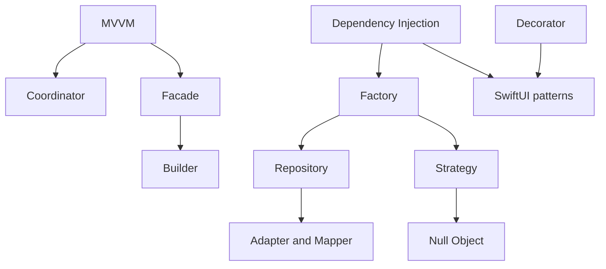

# Design Patterns — FocusUp Deep Dives

One file per pattern with definitions, FocusUp code references, diagrams, and interview talking points.

**Parent summary:** [`../10-design-patterns.md`](../10-design-patterns.md)

---

## Pattern index

| # | Pattern | File | Primary FocusUp example |
|---|---------|------|-------------------------|
| 1 | MVVM | [mvvm.md](mvvm.md) | `TaskListView` + `TaskListViewModel` |
| 2 | MVVM-C (Coordinator) | [mvvm-coordinator.md](mvvm-coordinator.md) | `AppCoordinator`, `TabCoordinator` |
| 3 | Dependency Injection | [dependency-injection.md](dependency-injection.md) | `AppContainer`, initializer injection |
| 4 | Repository | [repository.md](repository.md) | `TaskRepository` / `TaskRepositoryImpl` |
| 5 | Factory | [factory.md](factory.md) | `AppContainer.live`, `Repositories.live` |
| 6 | Strategy | [strategy.md](strategy.md) | `Clock`, `NotificationService` |
| 7 | Observer | [observer.md](observer.md) | `TaskUpdateNotifier` |
| 8 | Facade | [facade.md](facade.md) | `DashboardOrchestrator`, `AppRestorationCoordinator` |
| 9 | State | [state.md](state.md) | `TimerEngine` + `TimerState` |
| 10 | Adapter / Mapper | [adapter-mapper.md](adapter-mapper.md) | `TaskMapper` |
| 11 | Decorator | [decorator.md](decorator.md) | `NavigationRestorationModifier` |
| 12 | Builder | [builder.md](builder.md) | `DashboardStateAggregator.buildSnapshot` |
| 13 | Singleton | [singleton.md](singleton.md) | `PersistenceController.shared` |
| 14 | Null Object | [null-object.md](null-object.md) | `NoOpNotificationService` |
| 15 | SwiftUI patterns | [swiftui-patterns.md](swiftui-patterns.md) | Environment, composition root |

---

## How to study

1. Read [`../10-design-patterns.md`](../10-design-patterns.md) for the one-page map.
2. Pick patterns you are weak on and read the deep dive.
3. For each pattern, practice: **name → problem → file → one sentence why**.

---

## Pattern relationships

