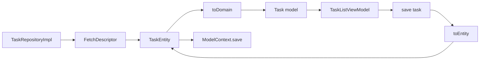

# Adapter / Mapper

## Definition

An **Adapter** converts one interface into another so incompatible types work together.

In FocusUp, **Mappers** are static adapters between **SwiftData entities** (`@Model`) and **domain structs** (pure Swift).

```
TaskEntity (persistence) ←→ TaskMapper ←→ Task (domain)
```

---

## Problem it solves

SwiftData entities:

- Are reference types tied to `ModelContext`
- Use storage-friendly fields (`statusRawValue`, `isCompleted`)
- Must not leak into ViewModels or Domain

Domain models:

- Are `struct`s, `Sendable`, testable without DB
- Use rich enums (`TaskStatus`, `TaskPriority`)

The mapper is the **translation layer**.

---

## FocusUp example: `TaskMapper`

**File:** `Data/Mappers/TaskMapper.swift`

### Entity → Domain

```swift
static func toDomain(_ entity: TaskEntity) -> Task {
  let status = TaskStatus(rawValue: entity.statusRawValue)
    ?? (entity.isCompleted ? .completed : .todo)
  return Task(
    id: entity.id,
    title: entity.title,
    milestones: entity.milestones.map(TaskMilestoneMapper.toDomain),
    ...
  )
}
```

### Domain → Entity

```swift
static func toEntity(_ domain: Task, context: ModelContext) -> TaskEntity {
  if let existing = fetchEntity(id: domain.id, context: context) {
    updateEntity(existing, from: domain, context: context)
    return existing
  }
  let entity = TaskEntity(...)
  context.insert(entity)
  return entity
}
```

Handles insert vs update — repository calls one method.

---

## Data flow



---

## All mappers

| Mapper | Entities | Domain |
|--------|----------|--------|
| `TaskMapper` | `TaskEntity` | `Task` |
| `TaskMilestoneMapper` | `TaskMilestoneEntity` | `TaskMilestone` |
| `FocusSessionMapper` | `FocusSessionEntity` | `FocusSession` |
| `RestSessionMapper` | `RestSessionEntity` | `RestSession` |
| `UserPreferencesMapper` | `UserPreferencesEntity` | `UserPreferences` |

Located under `Data/Mappers/`.

---

## Adapter vs Repository

| Repository | Mapper |
|------------|--------|
| CRUD orchestration | Field-level conversion |
| `fetchAll`, `save` | `toDomain`, `toEntity` |
| Depends on mapper | Stateless enum, no I/O |

---

## Interview answer (30 sec)

> SwiftData entities never leave the Data layer. `TaskMapper.toDomain` converts `TaskEntity` to a pure `Task` struct with proper enums; `toEntity` handles insert-or-update into the `ModelContext`. Repositories call mappers — features only see domain types.

---

## Files to know cold

- `Data/Mappers/TaskMapper.swift`
- `Data/Mappers/FocusSessionMapper.swift`
- `Data/Repositories/TaskRepositoryImpl.swift` — mapper usage

---

## Related patterns

- [repository.md](repository.md) — mapper sits inside repository impl
- [mvvm.md](mvvm.md) — ViewModels only see domain types
