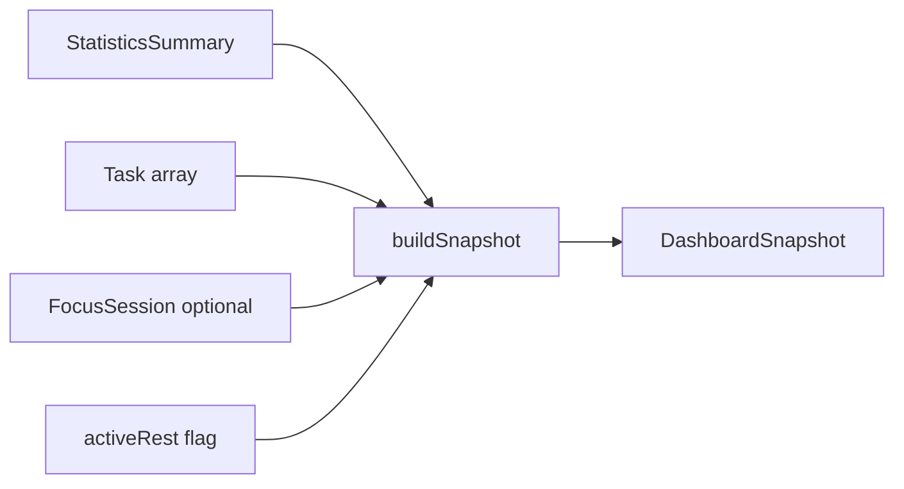

# Builder (lightweight)

## Definition

The **Builder** pattern constructs a **complex object step by step**. In FocusUp this appears as **pure static functions** that assemble DTOs from parts — not a fluent `Builder` class with chained methods.

---

## Problem it solves

`DashboardSnapshot` combines mood, greetings, statistics, priorities, continuity, and motivational copy. Inline construction in a ViewModel would be 50+ lines of tangled logic.

A builder function takes **inputs** and returns one **immutable snapshot**.

---

## FocusUp example: `DashboardStateAggregator`

**File:** `Domain/Dashboard/DashboardStateAggregator.swift`

```swift
enum DashboardStateAggregator {
  static func buildSnapshot(
    statistics: StatisticsSummary,
    tasks: [Task],
    activeFocus: FocusSession?,
    activeRest: Bool,
    now: Date = .now,
    calendar: Calendar = .current
  ) -> DashboardSnapshot {
    let todayMinutes = focusMinutesToday(...)
    let mood = resolveMood(...)
    let copy = greetingCopy(...)
    let motivation = motivationalMessage(...)
    let openTasks = tasks.contains { ... }

    return DashboardSnapshot(
      mood: mood,
      greetingTitle: copy.title,
      statistics: statistics,
      priorities: DashboardPriorityEngine.recommendations(...),
      continuity: continuityState(...),
      ...
    )
  }
}
```



---

## Called by facade

`DashboardOrchestrator.refresh()` fetches raw inputs, then delegates assembly to the builder:

```swift
return DashboardStateAggregator.buildSnapshot(
  statistics: statistics,
  tasks: allTasks,
  activeFocus: focusSessionManager.activeSession,
  activeRest: ...,
  now: clock.now()
)
```

**Orchestrator** = fetch + coordinate; **Aggregator** = pure construction.

---

## Other builder-style functions

| Function | File | Output |
|----------|------|--------|
| `FocusAnalyticsCalculator.buildStatisticsSummary` | Domain/Statistics | `StatisticsSummary` |
| `DashboardStateAggregator.activeSessionSnapshot` | Domain/Dashboard | `DashboardActiveSessionSnapshot` |
| `DashboardPriorityEngine.recommendations` | Domain/Dashboard | Priority list |

All are **pure functions** — easy to unit test without async or DB.

---

## Builder vs Factory

| Builder | Factory |
|---------|---------|
| Assembles **data** DTOs | Creates **service** objects |
| `buildSnapshot(...)` | `Repositories.live(...)` |
| No side effects | May open DB connections |

---

## Interview answer (30 sec)

> Complex dashboard UI state is built by pure static functions like `DashboardStateAggregator.buildSnapshot`. The orchestrator fetches statistics and tasks in parallel, then the aggregator resolves mood, greetings, and priorities into one `DashboardSnapshot`. It's a lightweight builder — no fluent API, but same separation of construction from fetching.

---

## Files to know cold

- `Domain/Dashboard/DashboardStateAggregator.swift`
- `Domain/Statistics/FocusAnalyticsCalculator.swift`
- `Features/Dashboard/Orchestration/DashboardOrchestrator.swift`

---

## Related patterns

- [facade.md](facade.md) — orchestrator calls builder
- [mvvm.md](mvvm.md) — ViewModel receives finished snapshot
