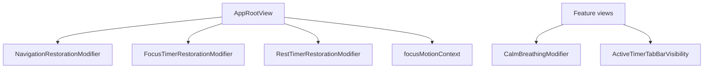

# Decorator (ViewModifier)

## Definition

The **Decorator** pattern attaches new behavior to an object **without subclassing**. In SwiftUI, `ViewModifier` is the decorator mechanism — wrap a view to add cross-cutting concerns.

```swift
content
  .modifier(NavigationRestorationModifier(...))
  .focusTimerRestoration(manager: ...)
```

---

## Problem it solves

Restoration, motion preferences, and tab-bar hiding affect many screens. Copy-pasting `onChange(of: scenePhase)` into every view violates DRY and risks inconsistent behavior.

Decorators compose behavior on the **composition root** or feature root.

---

## FocusUp decorators



| Modifier | File | Adds |
|----------|------|------|
| `NavigationRestorationModifier` | `Core/Navigation/Restoration/` | Persist/restore nav on background |
| `FocusTimerRestorationModifier` | `Features/Focus/Restoration/` | Persist focus timer snapshot |
| `RestTimerRestorationModifier` | `Features/Rest/Restoration/` | Persist rest timer snapshot |
| `CreateTaskDraftRestorationModifier` | `Features/Tasks/Form/Restoration/` | Restore create-task draft |
| `CalmBreathingModifier` | Design system | Breathing animation overlay |
| `ActiveTimerTabBarVisibility` | Focus feature | Hide tab bar during active timer |

---

## Example: timer restoration decorator

**File:** `Features/Focus/Restoration/FocusTimerRestorationModifier.swift`

```swift
struct FocusTimerRestorationModifier: ViewModifier {
  @SceneStorage(...) private var persistedData: Data?
  @Environment(\.scenePhase) private var scenePhase

  func body(content: Content) -> some View {
    content
      .onChange(of: scenePhase) { _, newPhase in
        guard newPhase == .background || newPhase == .inactive else { return }
        persistCurrentState()
      }
  }
}
```

**Persists** on background; **does not restore** — restore runs in `AppRestorationCoordinator` (separation of concerns).

---

## Decorator vs Coordinator

| Decorator | Coordinator |
|-----------|-------------|
| Side effects on view lifecycle | Owns navigation state |
| Compose via `.modifier()` | `AppCoordinator` reference |
| SceneStorage read/write | `NavigationPath` mutations |

---

## Extension API pattern

```swift
extension View {
  func navigationRestoration(coordinator: AppCoordinator) -> some View {
    modifier(NavigationRestorationModifier(coordinator: coordinator))
  }
}
```

Readable call sites: `.navigationRestoration(coordinator: container.coordinator)`.

---

## Interview answer (30 sec)

> Cross-cutting UI behavior uses SwiftUI ViewModifiers as decorators. `NavigationRestorationModifier` persists tab and path on background; timer modifiers dual-write SceneStorage and UserDefaults. They're attached on `AppRootView` so individual screens stay unaware of restoration plumbing.

---

## Files to know cold

- `Core/Navigation/Restoration/NavigationRestorationModifier.swift`
- `Features/Focus/Restoration/FocusTimerRestorationModifier.swift`
- `App/AppRootView.swift` — composition of modifiers

---

## Related patterns

- [facade.md](facade.md) — `AppRestorationCoordinator` performs restore; modifiers persist
- [swiftui-patterns.md](swiftui-patterns.md) — composition root
- [observer.md](observer.md) — modifiers use `onChange` similarly to `onReceive`
