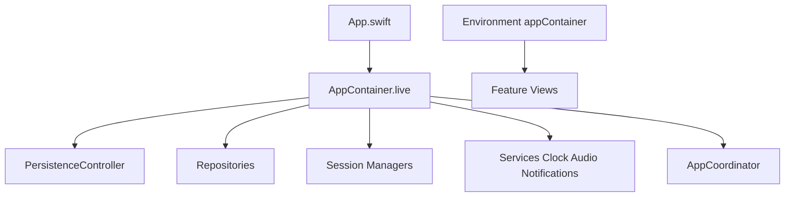

# Dependency Injection (Manual)

## Definition

**Dependency Injection (DI)** means dependencies are **passed in** (constructor, property, or environment) instead of being created inside a type with `TaskRepositoryImpl()` or `URLSession.shared`.

FocusUp uses **manual DI** — no third-party container (Swinject, etc.).

---

## Problem it solves

| Without DI | With DI |
|------------|---------|
| Hard-coded concrete types | Swap implementations per context |
| Hidden dependency graph | Explicit wiring in one place |
| Tests hit real DB/network | Inject mocks, in-memory repos, `TestClock` |

---

## Composition root: `AppContainer`



**File:** `Core/DependencyInjection/AppContainer.swift`

`AppContainer` is the **composition root** — the only place that knows how to wire the full object graph.

```swift
final class AppContainer {
  let persistence: PersistenceController
  let coordinator: AppCoordinator
  let repositories: Repositories
  let focusSessionManager: FocusSessionManager
  // ...

  init(
    persistence: PersistenceController,
    coordinator: AppCoordinator,
    repositories: Repositories? = nil,
    clock: any Clock = SystemClock(),
    ...
  ) {
    let resolvedRepositories = repositories ?? .live(using: persistence)
    // wire managers with resolved deps
  }
}
```

---

## Three injection styles in FocusUp

### 1. Initializer injection (preferred)

ViewModels and managers take protocols in `init`:

```swift
final class TaskListViewModel {
  private let repository: any TaskRepository
  init(repository: any TaskRepository) { ... }
}
```

### 2. Factory statics on container

```swift
static let live = AppContainer()
static let preview: AppContainer = { ... }()
static let testing: AppContainer = { ... }()
```

### 3. SwiftUI Environment

```swift
@Environment(\.appContainer) private var container
```

Defined via `AppContainerKey` in `AppContainer.swift` — propagates the graph without passing 10 parameters through every initializer.

---

## Context variants

| Context | Container | Typical deps |
|---------|-----------|--------------|
| Production | `.live` | Real repos, `SystemClock`, real notifications |
| Previews | `.preview` | `Preview*Repository`, `NoOp*` services |
| Tests | Custom `AppContainer(...)` or `.testing` | In-memory persistence, mocks, `TestClock` |

---

## Interview answer (30 sec)

> Dependencies are wired manually in `AppContainer`, the composition root. ViewModels and managers take protocol-typed parameters in their initializers. Production uses `AppContainer.live`; previews use `.preview` with stub repos and no-op services. SwiftUI reads the container from `\.appContainer` environment. No service locator — the graph is explicit and interview-friendly.

---

## Trade-offs

| Pro | Con |
|-----|-----|
| No framework magic | `AppContainer` grows with features |
| Easy to trace in interviews | `DashboardOrchestrator` not yet in container (created in ViewModel) |
| Test-friendly | Must remember to inject in every new type |

---

## Files to know cold

- `Core/DependencyInjection/AppContainer.swift`
- `Core/DependencyInjection/AppContainer+Repositories.swift`
- `App/App.swift` — attaches `.appContainer(.live)`

---

## Related patterns

- [factory.md](factory.md) — `AppContainer.live` creates the graph
- [strategy.md](strategy.md) — inject `Clock`, `NotificationService` implementations
- [swiftui-patterns.md](swiftui-patterns.md) — Environment propagation
