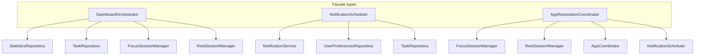

# Facade

## Definition

A **Facade** provides a **simplified interface** to a complex subsystem. Callers interact with one type instead of coordinating many dependencies themselves.

---

## Problem it solves

Dashboard refresh needs statistics, tasks, active sessions, and clock time. A ViewModel calling four repos plus two managers becomes orchestration soup.

A facade **hides the steps** behind one method.

---

## FocusUp facades



---

## 1. `DashboardOrchestrator`

**File:** `Features/Dashboard/Orchestration/DashboardOrchestrator.swift`

```swift
func refresh(invalidateStatisticsCache: Bool = false) async throws -> DashboardSnapshot {
  async let analytics = statisticsRepository.fetchAnalytics()
  async let tasks = taskRepository.fetchAll()
  let statistics = try await analytics
  let allTasks = try await tasks

  return DashboardStateAggregator.buildSnapshot(
    statistics: statistics,
    tasks: allTasks,
    activeFocus: focusSessionManager.activeSession,
    activeRest: restSessionManager.activeSession?.status.isActiveLifecycle == true,
    now: clock.now()
  )
}
```

**One call** → parallel fetches + aggregation. `DashboardViewModel` does not know fetch order.

---

## 2. `NotificationScheduler`

**File:** `Core/Notifications/NotificationScheduler.swift`

Wraps:

- `NotificationService` (system APIs)
- `UserPreferencesRepository` (permission, quiet hours)
- `TaskRepository` (deadline reminders)
- Planning logic (`NotificationPlanner`)

ViewModels call `rescheduleAll()` — not individual `UNNotificationRequest` construction.

---

## 3. `AppRestorationCoordinator`

**File:** `Core/AppLifecycle/AppRestorationCoordinator.swift`

Single entry `performColdRestore` over:

- Session managers (`restoreOnLaunch`)
- Timer snapshots (SceneStorage + UserDefaults)
- Navigation reconcile
- Notifications + foreground refresh

See [../16-app-restoration-coordinator.md](../16-app-restoration-coordinator.md).

---

## Facade vs Orchestrator naming

In FocusUp, **Orchestrator** and **Coordinator** names signal facades with **ordered workflows**:

| Name | Implies |
|------|---------|
| Orchestrator | Multi-read refresh (`DashboardOrchestrator`) |
| Coordinator | Multi-step pipeline with ordering (`AppRestorationCoordinator`) |
| Scheduler | Time-based side effects (`NotificationScheduler`) |

All are facade variants — simplified surface over subsystems.

---

## Interview answer (30 sec)

> Facades simplify multi-subsystem work: `DashboardOrchestrator.refresh` parallel-fetches analytics and tasks then builds one snapshot. `NotificationScheduler` wraps UNUserNotificationCenter, preferences, and task deadlines behind `rescheduleAll`. `AppRestorationCoordinator` is a facade for the entire cold-restore pipeline so `AppRootView` makes one call.

---

## Trade-offs

| Pro | Con |
|-----|-----|
| Thin ViewModels | Facade types can grow large |
| Clear entry points | `DashboardOrchestrator` not in `AppContainer` yet |
| Testable as units | Overlap with "Use Case" naming in clean architecture |

---

## Files to know cold

- `Features/Dashboard/Orchestration/DashboardOrchestrator.swift`
- `Core/Notifications/NotificationScheduler.swift`
- `Core/AppLifecycle/AppRestorationCoordinator.swift`

---

## Related patterns

- [builder.md](builder.md) — `DashboardStateAggregator` builds DTO inside orchestrator
- [mvvm-coordinator.md](mvvm-coordinator.md) — navigation coordinator is different (state owner, not facade)
