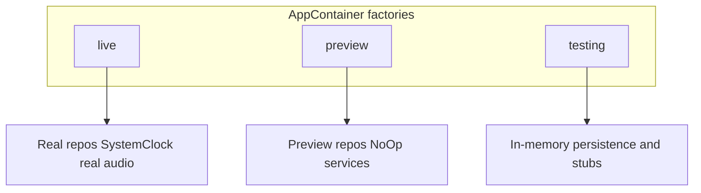

# Factory

## Definition

A **Factory** centralizes object creation so callers request a product without knowing construction details.

FocusUp uses **simple factories** (static methods) and **abstract factory**-style bundles that create **families** of related objects.

---

## Problem it solves

Scattering `TaskRepositoryImpl(context: ...)` across the app means:

- Every new dependency requires N call-site updates
- Preview/test wiring diverges from production
- Interviewers cannot find "where the graph is built"

Factories put creation in one place.

---

## Simple Factory: `AppContainer` variants

**File:** `Core/DependencyInjection/AppContainer.swift`

```swift
static let live = AppContainer()           // production graph
static let preview: AppContainer = { ... }()  // previews
static let testing: AppContainer = { ... }()  // tests
```

Each static builds a complete `AppContainer` with the right persistence, repos, and no-op services.



---

## Abstract Factory: `Repositories`

**File:** `Core/DependencyInjection/AppContainer+Repositories.swift`

`Repositories.live(using:)` creates a **family** of five matching implementations:

```swift
static func live(using persistence: PersistenceController) -> Repositories {
  let context = persistence.mainContext
  return Repositories(
    taskRepository: TaskRepositoryImpl(context: context),
    focusRepository: FocusRepositoryImpl(context: context),
    restRepository: RestRepositoryImpl(context: context),
    statisticsRepository: StatisticsRepositoryImpl(context: context),
    userPreferencesRepository: UserPreferencesRepositoryImpl(context: context)
  )
}
```

| Method | Family produced |
|--------|-----------------|
| `.live(using:)` | Five `*RepositoryImpl` sharing one `ModelContext` |
| `.preview` | Five `Preview*Repository` stubs |
| `.testing(using:)` | Currently delegates to `live` (in-memory persistence) |

This is **Abstract Factory** in practice: one factory method returns a consistent set of related products.

---

## `PersistenceController` factories

**File:** `Data/Persistence/PersistenceController.swift`

| Static | Purpose |
|--------|---------|
| `.shared` | On-disk production container |
| `.preview` | In-memory for SwiftUI previews |
| `.testing` | In-memory for unit tests |

---

## Factory vs DI

| Factory | DI |
|---------|-----|
| **Creates** objects | **Receives** objects |
| `Repositories.live(...)` | `TaskListViewModel(repository:)` |

They work together: factories build the graph; DI injects it.

---

## Interview answer (30 sec)

> `AppContainer.live`, `.preview`, and `.testing` are factory entry points for the whole dependency graph. `Repositories.live(using:)` is an abstract factory — it returns five repository implementations that share one SwiftData context. ViewModels never call factories; only the composition root does.

---

## Trade-offs

| Pro | Con |
|-----|-----|
| Single wiring location | `AppContainer` file grows |
| Preview/test parity | `testing` still uses `Repositories.preview` stubs — known gap |

---

## Files to know cold

- `Core/DependencyInjection/AppContainer.swift`
- `Core/DependencyInjection/AppContainer+Repositories.swift`
- `Data/Persistence/PersistenceController.swift`

---

## Related patterns

- [dependency-injection.md](dependency-injection.md) — consumers receive factory output
- [singleton.md](singleton.md) — `PersistenceController.shared` used by `.live`
- [null-object.md](null-object.md) — preview factory wires `NoOp*` services
