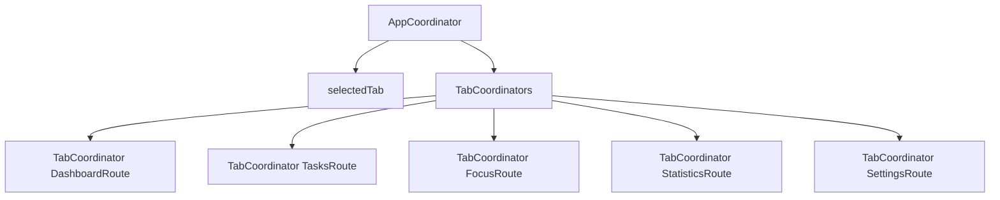
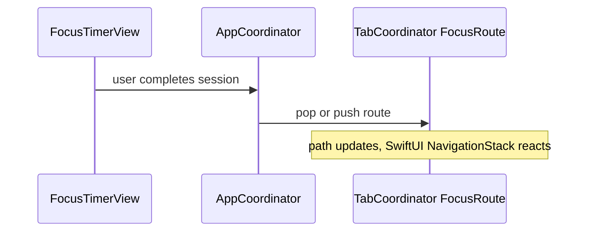

# MVVM-C (Coordinator)

## Definition

**MVVM-C** adds a **Coordinator** layer that owns navigation state. ViewModels do not push routes or know about `NavigationPath`.

```
View → ViewModel (presentation)
View → Coordinator (navigation)
```

---

## Problem it solves

When navigation lives in ViewModels or Views:

- Deep links and tab switching duplicate logic
- Restoration must parse routes in many places
- Tests need SwiftUI to verify navigation

Coordinators centralize **where the user is** in the app.

---

## FocusUp structure



| Type | File | Owns |
|------|------|------|
| `AppCoordinator` | `Core/Navigation/AppCoordinator.swift` | Selected tab, deep links, cold-restore flags |
| `TabCoordinator<Route>` | `Core/Navigation/TabCoordinator.swift` | Per-tab `NavigationPath` |
| `TabCoordinators` | `Core/Navigation/TabCoordinators.swift` | Bundle of five tab coordinators |

---

## Key behaviors

### Tab selection

```swift
func selectTab(_ tab: AppTab) {
  selectedTab = tab
}
```

### Deep links

```swift
func open(_ deepLink: AppDeepLink) {
  switch deepLink {
  case .focus(let route):
    selectTab(.focus)
    tabCoordinators.focus.setPath([route])
  ...
  }
}
```

One entry point for notifications, widgets, or future URL schemes.

### Restoration integration

- `hasCompletedColdRestore` — gate for navigation restore
- `reconcileNavigationWithSessions` — align routes with active focus/rest sessions
- `navigationRestoreGeneration` — force SwiftUI to re-apply restored stacks

See [../16-app-restoration-coordinator.md](../16-app-restoration-coordinator.md).

---

## View wiring

`RootTabView` receives `coordinator` and binds tab selection + navigation stacks. Views call coordinator methods (or bindings) instead of mutating paths directly.



---

## Why routes are `Codable`

`FocusRoute`, `TasksRoute`, etc. serialize into `PersistedNavigationState` for SceneStorage restoration. Coordinator-owned paths are persistence-friendly.

---

## Interview answer (30 sec)

> FocusUp uses MVVM-C: ViewModels handle presentation; `AppCoordinator` owns tab selection and each tab's `NavigationPath` via generic `TabCoordinator<Route>`. Deep links go through `open(_:)`. After cold restore, `reconcileNavigationWithSessions` ensures routes match active sessions. Navigation is testable without UI in `AppCoordinatorNavigationTests`.

---

## Files to know cold

- `Core/Navigation/AppCoordinator.swift`
- `Core/Navigation/AppCoordinator+TabNavigation.swift`
- `Core/Navigation/AppCoordinator+RestorationReconciliation.swift`
- `Core/Navigation/Restoration/NavigationRestorationModifier.swift`

---

## Related patterns

- [mvvm.md](mvvm.md) — presentation layer
- [facade.md](facade.md) — `AppRestorationCoordinator` coordinates restore + nav
- [state.md](state.md) — coordinator holds navigation state machine
