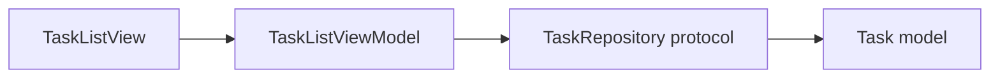
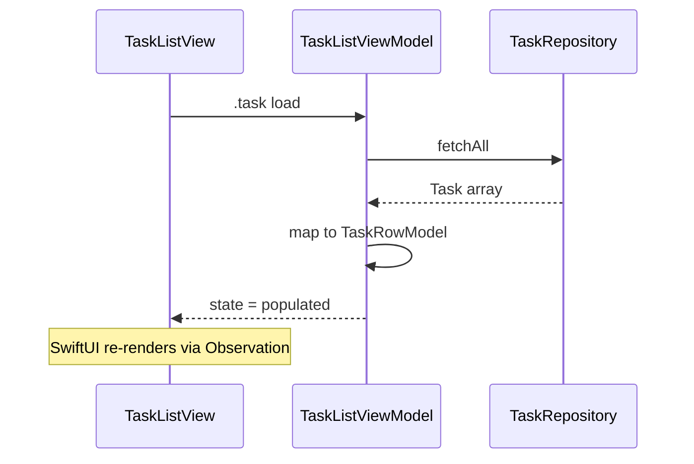

# MVVM (Model–View–ViewModel)

## Definition

**MVVM** separates:

| Layer | Responsibility |
|-------|----------------|
| **Model** | Domain data and business rules |
| **View** | SwiftUI layout, bindings, user gestures |
| **ViewModel** | Presentation state, formatting, orchestration of reads/writes |

The View binds to the ViewModel; the ViewModel talks to repositories/managers — not SwiftUI types.

---

## Problem it solves

Without MVVM, views accumulate logic: fetching, error handling, string formatting, and state flags. That makes SwiftUI previews hard and unit tests impossible without UI.

MVVM keeps views **declarative** and moves testable logic into `@Observable` types.

---

## FocusUp example

**Tasks list flow:**



| File | Role |
|------|------|
| `Features/Tasks/TaskList/TaskListView.swift` | Renders list from `viewModel.state` |
| `Features/Tasks/TaskList/TaskListViewModel.swift` | Loads tasks, maps to `TaskRowModel`, sets `TaskListViewState` |
| `Domain/Tasks/Task.swift` | Pure domain struct |

### ViewModel shape

```swift
@MainActor
@Observable
final class TaskListViewModel {
  private let repository: any TaskRepository
  var state: TaskListViewState = .loading
  var selectedFilter: TasksRoute = .today

  init(repository: any TaskRepository) { ... }
  func load() async { ... }
}
```

### View state enum

`TaskListViewState` encodes UI modes explicitly: `.loading`, `.empty`, `.populated`, `.error` — the view switches on one property instead of many booleans.

### Row models

`TaskRowModel` is a **presentation DTO** — computed properties like `milestoneSummary` keep formatting out of the View.

---

## Data flow



---

## What MVVM is NOT in FocusUp

| Not MVVM | What FocusUp uses instead |
|----------|---------------------------|
| Navigation in ViewModel | **Coordinator** (`AppCoordinator`) |
| Timer lifecycle in ViewModel | **Session managers** (`FocusSessionManager`) |
| Multi-repo dashboard reads | **Orchestrator** (`DashboardOrchestrator`) |

ViewModels are thin where side effects are heavy — managers own session/timer/audio/Live Activity.

---

## Interview answer (30 sec)

> Every feature follows MVVM: SwiftUI views bind to `@Observable` ViewModels. ViewModels take repository protocols via initializer injection, expose a small view-state enum, and map domain models to row DTOs. Domain structs live in `Domain/` with no SwiftUI imports. Navigation and session side effects stay in coordinators and managers so ViewModels stay unit-testable.

---

## Files to know cold

- `Features/Tasks/TaskList/TaskListViewModel.swift`
- `Features/Focus/Timer/FocusTimerViewModel.swift`
- `Features/Dashboard/DashboardViewModel.swift`

---

## Related patterns

- [mvvm-coordinator.md](mvvm-coordinator.md) — navigation layer on top of MVVM
- [dependency-injection.md](dependency-injection.md) — ViewModels receive repos via init
- [repository.md](repository.md) — data access behind protocols
