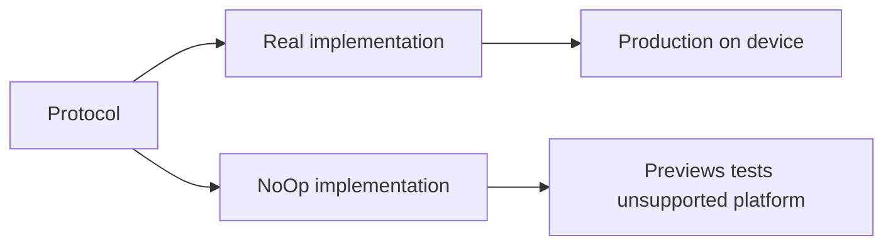

# Null Object

## Definition

The **Null Object** pattern provides a **no-op implementation** of an interface instead of using `nil` or optional checks everywhere.

Callers invoke methods unconditionally; the null implementation does nothing (or returns safe defaults).

---

## Problem it solves

Without null objects:

```swift
if let player = ambientSoundPlayer {
  player.play(category: .rain)
}
```

Repeats across session managers, previews, and tests. Optional branching pollutes business logic.

With null object:

```swift
ambientSoundPlayer.play(category: .rain)  // NoOp silently ignores
```

**Same code path** in production, previews, and tests.

---

## FocusUp null objects



| Protocol | NoOp type | File |
|----------|-----------|------|
| `NotificationService` | `NoOpNotificationService` | `Core/Notifications/NotificationService.swift` |
| `SessionAmbientSoundPlaying` | `NoOpSessionAmbientSoundPlayer` | `Core/Audio/SessionAmbientSoundPlaying.swift` |
| `LiveActivityManaging` | `NoOpLiveActivityManager` | `Features/LiveActivities/Services/LiveActivityManaging.swift` |

---

## Example: ambient sound

```swift
@MainActor
final class NoOpSessionAmbientSoundPlayer: SessionAmbientSoundPlaying {
  func play(category: SessionAmbientSoundCategory) {}
  func stop() {}
}
```

`FocusSessionManager` always calls `ambientSoundPlayer.play(...)` — no `if preview` checks.

---

## Example: notifications in tests

`NoOpNotificationService` records scheduled requests for assertions without touching `UNUserNotificationCenter`:

```swift
func schedule(_ request: LocalNotificationRequest) async throws {
  scheduled.append(request)
}
```

Used extensively in `NotificationSchedulerTests`.

---

## Wired in `AppContainer.preview`

```swift
static let preview: AppContainer = {
  let noopLive = NoOpLiveActivityManager()
  let noopNotify = NoOpNotificationService()
  let sound = NoOpSessionAmbientSoundPlayer()
  return AppContainer(
    ...
    ambientSoundPlayer: sound,
    liveActivityManager: noopLive,
    notificationService: noopNotify,
    ...
  )
}()
```

Previews never play audio, schedule real notifications, or start Live Activities.

---

## Null Object vs Strategy

| Null Object | Strategy |
|-------------|----------|
| Purpose: **do nothing** safely | Purpose: **swap algorithms** |
| One special no-op impl | Multiple real behaviors |

In FocusUp, `NoOp*` types are **both** — they are strategy implementations chosen for preview/test/platform.

---

## Interview answer (30 sec)

> Instead of optional services, FocusUp uses NoOp implementations: `NoOpNotificationService`, `NoOpSessionAmbientSoundPlayer`, `NoOpLiveActivityManager`. Session managers call protocols unconditionally; previews and tests inject no-ops so production code paths stay identical without side effects.

---

## Files to know cold

- `Core/Notifications/NotificationService.swift`
- `Core/Audio/SessionAmbientSoundPlaying.swift`
- `Features/LiveActivities/Services/LiveActivityManaging.swift`
- `Core/DependencyInjection/AppContainer.swift` — preview wiring

---

## Related patterns

- [strategy.md](strategy.md) — NoOp is a strategy variant
- [factory.md](factory.md) — preview factory selects NoOp family
- [dependency-injection.md](dependency-injection.md) — inject NoOp in tests
