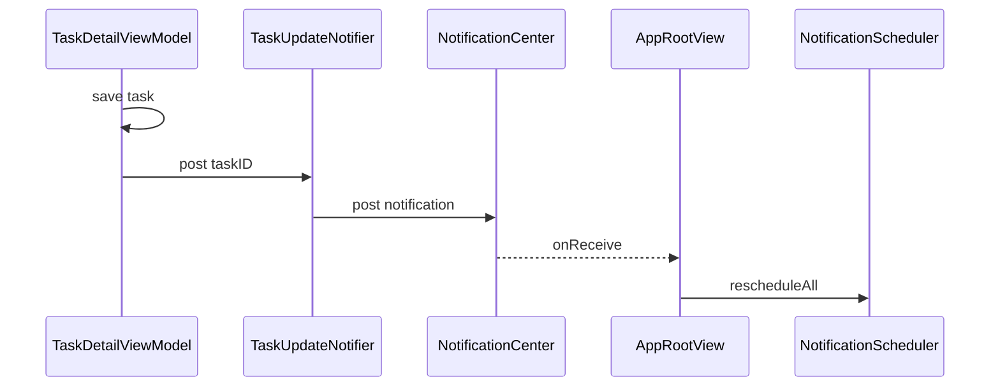

# Observer

## Definition

The **Observer** pattern lets one object **notify** multiple subscribers when something changes, without the publisher knowing who listens.

FocusUp uses **NSNotificationCenter** (Foundation's observer bus) for cross-feature events.

---

## Problem it solves

When a task is updated in the Tasks feature, the app should **reschedule local notifications**. Tasks should not import `NotificationScheduler` directly — that creates feature coupling.

Observer decouples: Tasks **posts**; App lifecycle **subscribes**.

---

## FocusUp implementation

### Publisher: `TaskUpdateNotifier`

**File:** `Features/Tasks/TaskUpdateNotifier.swift`

```swift
enum TaskUpdateNotifier {
  static let name = Notification.Name("FocusUp.task.updated")

  static func post(taskID: UUID) {
    NotificationCenter.default.post(name: name, object: taskID)
  }
}
```

Called after task create/update/delete (e.g. from `TaskDetailViewModel`, `CreateTaskViewModel`).

### Subscriber: `AppRootView`

**File:** `App/AppRootView.swift`

```swift
.onReceive(NotificationCenter.default.publisher(for: TaskUpdateNotifier.name)) { _ in
  guard container.coordinator.hasCompletedColdRestore else { return }
  Task {
    await container.notificationScheduler.rescheduleAll()
  }
}
```

Only reschedules after cold restore completes — avoids racing with incomplete state.

---

## Flow diagram



---

## Observer vs other patterns

| Pattern | FocusUp usage |
|---------|---------------|
| **Observer** | `NotificationCenter` for task updates → notifications |
| **Observation** (`@Observable`) | SwiftUI reactivity for ViewModels |
| **Combine** | `onReceive` bridges NC to SwiftUI |

Task updates use NC; UI state uses `@Observable` — different tools for different scopes.

---

## Trade-offs

| Pro | Con |
|-----|-----|
| Loose coupling between features | Global stringly-typed channel |
| No import cycle | Harder to trace than direct calls |
| Simple for one event | Does not scale to many events without discipline |

**Alternative considered at scale:** async stream or domain event bus inside `AppContainer`.

---

## Interview answer (30 sec)

> When tasks change, ViewModels call `TaskUpdateNotifier.post`. `AppRootView` observes that notification and calls `notificationScheduler.rescheduleAll` after cold restore. Tasks feature never imports the scheduler — classic Observer via `NotificationCenter`.

---

## Files to know cold

- `Features/Tasks/TaskUpdateNotifier.swift`
- `App/AppRootView.swift` — subscriber
- `Features/Tasks/Detail/TaskDetailViewModel.swift` — publisher call sites

---

## Related patterns

- [facade.md](facade.md) — `NotificationScheduler` hides scheduling complexity
- [swiftui-patterns.md](swiftui-patterns.md) — `onReceive` in SwiftUI
