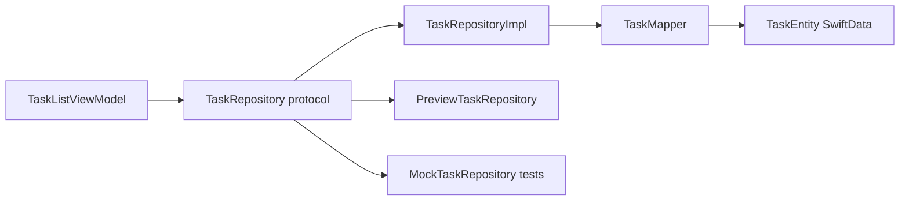
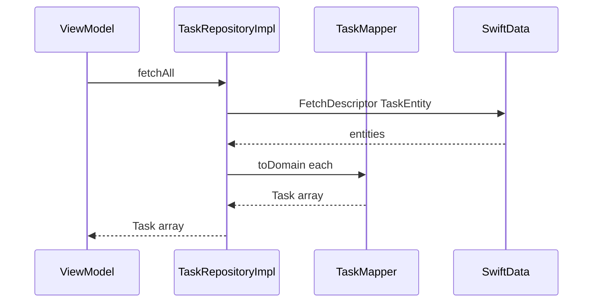

# Repository

## Definition

The **Repository** pattern mediates between **domain logic** and **data storage** behind a protocol. Callers depend on `TaskRepository`, not `ModelContext` or `TaskEntity`.

```
Domain / Features → Repository protocol → RepositoryImpl → SwiftData
```

---

## Problem it solves

| Without repository | With repository |
|--------------------|-----------------|
| SwiftData leaks into ViewModels | Domain stays persistence-agnostic |
| Hard to test without DB | Inject `MockTaskRepository` |
| Schema changes break features | Change mapper + impl only |

---

## FocusUp layout



| Layer | Location | Example |
|-------|----------|---------|
| Protocol | `Domain/Tasks/TaskRepository.swift` | `fetchAll()`, `save(_:)` |
| Domain model | `Domain/Tasks/Task.swift` | Pure struct |
| Implementation | `Data/Repositories/TaskRepositoryImpl.swift` | Uses `ModelContext` |
| Mapper | `Data/Mappers/TaskMapper.swift` | Entity ↔ domain |
| Preview stub | `Data/Repositories/Preview/PreviewTaskRepository.swift` | Fixed sample data |

**Five repository pairs:** Task, Focus, Rest, Statistics, UserPreferences.

---

## Protocol example (conceptual)

```swift
protocol TaskRepository: Sendable {
  func fetchAll() async throws -> [Task]
  func fetch(id: UUID) async throws -> Task?
  func save(_ task: Task) async throws
  func delete(id: UUID) async throws
}
```

Domain types never import SwiftData.

---

## Implementation flow



**Write path:** `Task` → `TaskMapper.toEntity` → insert/update → `context.save()`.

---

## Repository bundle

`AppContainer.Repositories` groups all five protocols — created together by `Repositories.live(using:)` (see [factory.md](factory.md)).

---

## Interview answer (30 sec)

> Each aggregate has a protocol in Domain and an implementation in Data. `TaskRepositoryImpl` uses SwiftData's `ModelContext`, maps through `TaskMapper` to pure `Task` structs, and is swapped in `AppContainer` for production, preview stubs, or test mocks. Features never import SwiftData.

---

## Files to know cold

- `Domain/Tasks/TaskRepository.swift`
- `Data/Repositories/TaskRepositoryImpl.swift`
- `Data/Mappers/TaskMapper.swift`
- `Data/Repositories/FocusRepositoryImpl.swift` — includes `fetchActive()` for restoration

---

## Related patterns

- [adapter-mapper.md](adapter-mapper.md) — mapping layer inside repository
- [dependency-injection.md](dependency-injection.md) — inject protocol, not impl
- [factory.md](factory.md) — `Repositories.live` creates the family
