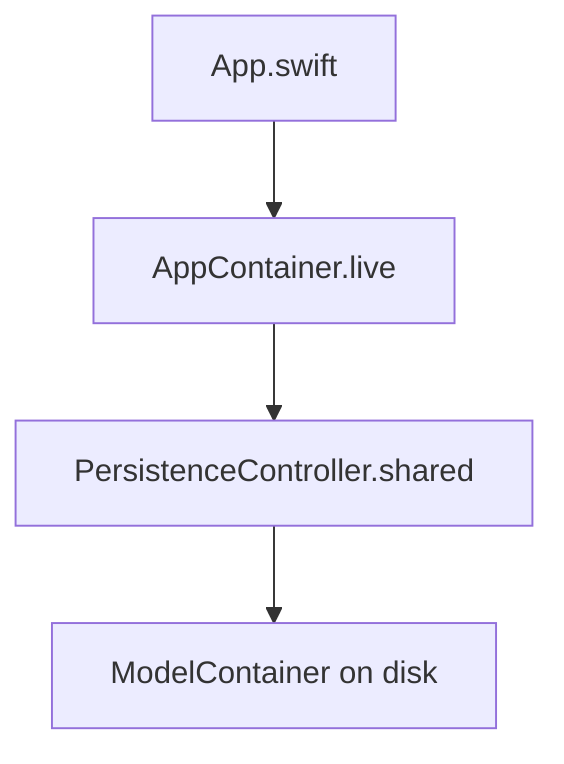

# Singleton (limited)

## Definition

A **Singleton** ensures a type has **one shared instance** accessed globally (e.g. `static let shared`).

FocusUp uses singletons **sparingly** at the app entry boundary — not as a general DI strategy.

---

## Problem it solves

The app needs exactly one `ModelContainer` on disk and one production `AppContainer` wired at launch. A singleton avoids passing persistence through every bootstrap frame.

---

## FocusUp singletons



| Singleton | File | Role |
|-----------|------|------|
| `PersistenceController.shared` | `Data/Persistence/PersistenceController.swift` | Production SwiftData container |
| `AppContainer.live` | `Core/DependencyInjection/AppContainer.swift` | Production dependency graph |

```swift
// PersistenceController
static let shared: PersistenceController = {
  do {
    return try PersistenceController(inMemory: false)
  } catch {
    fatalError("Failed to create persistence: \(error)")
  }
}()

// AppContainer
convenience init() {
  self.init(persistence: .shared, coordinator: AppCoordinator())
}
static let live = AppContainer()
```

---

## Non-singleton alternatives (preferred in tests)

| Static | Purpose |
|--------|---------|
| `PersistenceController.preview` | In-memory, new instance |
| `PersistenceController.testing` | In-memory for tests |
| `AppContainer.preview` | Preview graph |
| Custom `AppContainer(...)` init | Full control in unit tests |

**Rule:** Tests construct fresh containers; they do not rely on `.shared` or `.live`.

---

## Singleton vs Service Locator

FocusUp is **not** a service locator app:

- Features use `@Environment(\.appContainer)` — injected at root, not looked up globally inside domain code
- ViewModels take protocols in `init`, not `AppContainer.live.taskRepository`

Singletons bootstrap the graph; **injection** distributes it.

---

## Trade-offs

| Pro | Con |
|-----|-----|
| Simple app entry | `fatalError` on persistence init failure |
| One DB on disk | Harder to test if code reaches for `.shared` directly |
| Familiar iOS pattern | Hidden global state if overused |

**Known weakness:** `PersistenceController.shared` uses `fatalError` — documented in `14-project-review.md`.

---

## Interview answer (30 sec)

> Singletons are limited to bootstrap: `PersistenceController.shared` for the on-disk SwiftData container and `AppContainer.live` for the production graph. Tests and previews use separate in-memory instances. Feature code depends on injected protocols, not global lookups — singletons compose the root, they don't replace DI.

---

## Files to know cold

- `Data/Persistence/PersistenceController.swift`
- `Core/DependencyInjection/AppContainer.swift`
- `App/App.swift`

---

## Related patterns

- [factory.md](factory.md) — `.live` factory uses `.shared`
- [dependency-injection.md](dependency-injection.md) — singleton seeds the graph
