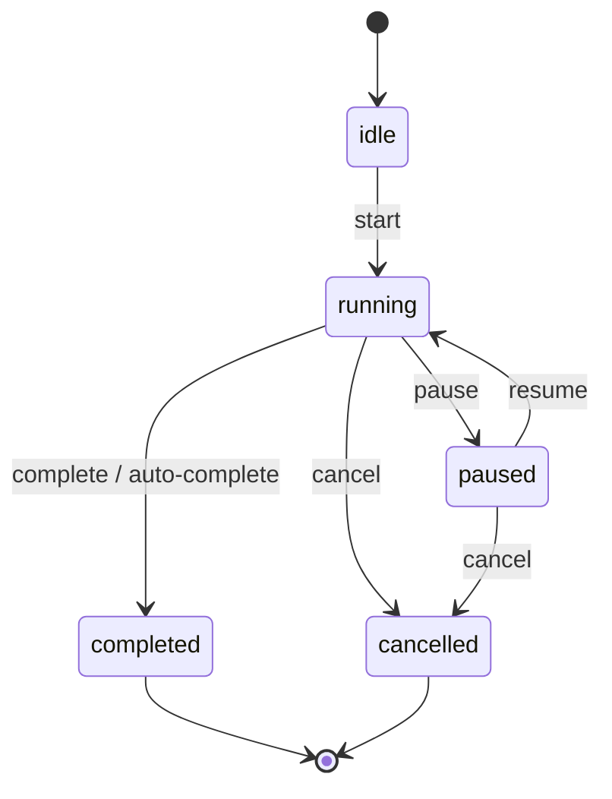

# State

## Definition

The **State** pattern encapsulates behavior that **varies with internal state**. An object delegates actions to state-specific logic or guards transitions so invalid operations are no-ops.

FocusUp applies this with an explicit `TimerState` enum and transition guards in `TimerEngine`.

---

## Problem it solves

A timer that allows `pause()` while idle or `resume()` while running produces bugs and corrupt restoration snapshots.

Centralizing transitions in one engine keeps session managers and ViewModels from duplicating timer rules.

---

## `TimerState` enum

**File:** `Core/Timer/TimerState.swift`

States: `idle`, `running`, `paused`, `completed`, `cancelled`.

Each state implies which operations are legal.

---

## `TimerEngine` transition guards

**File:** `Core/Timer/TimerEngine.swift`

```swift
func pause(at date: Date? = nil) {
  guard snapshot.state == .running else { return }
  // accumulate elapsed, set .paused
}

func resume(at date: Date? = nil) {
  guard snapshot.state == .paused else { return }
  // set .running, new segmentStartedAt
}
```

Invalid calls silently return — the engine stays consistent.



---

## State + Snapshot

`TimerEngine` stores a `TimerSnapshot` (state + timestamps). Restoration replays snapshot into the engine:

```swift
func restore(from snapshot: TimerSnapshot) { ... }
func reconcileAfterRestore(at date: Date) { ... }
```

State pattern + immutable snapshot = safe force-quit recovery.

---

## Other state enums in FocusUp

| Enum | Where | Purpose |
|------|-------|---------|
| `TaskListViewState` | `TaskListViewModel` | UI loading/empty/error |
| `NotificationAuthorizationState` | Notifications | Permission flow |
| `FocusSessionStatus` | Domain | Session lifecycle |

ViewModel UI state is a **presentation state** variant; `TimerEngine` is **domain state machine**.

---

## Interview answer (30 sec)

> `TimerEngine` implements a state machine with `TimerState`. Methods like `pause` and `resume` guard on current state so invalid transitions are ignored. Elapsed time uses wall-clock segments in `TimerSnapshot`, which makes restoration correct after backgrounding. Session managers own the engine; ViewModels observe elapsed/remaining.

---

## Files to know cold

- `Core/Timer/TimerEngine.swift`
- `Core/Timer/TimerSnapshot.swift`
- `Core/Timer/TimerState.swift`
- `Features/Focus/Managers/FocusSessionManager.swift` — calls engine lifecycle

---

## Related patterns

- [strategy.md](strategy.md) — `Clock` injected into engine
- [facade.md](facade.md) — session manager facades timer + persistence + side effects
