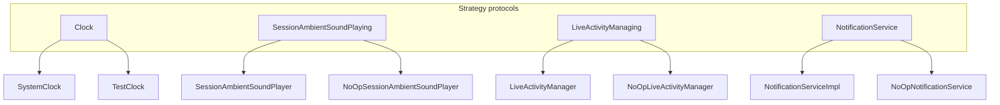

# Strategy

## Definition

The **Strategy** pattern defines a family of algorithms behind a **protocol**. The client holds a reference to the strategy and can swap implementations without changing its own code.

```swift
protocol Clock { func now() -> Date }
// SystemClock | TestClock
```

---

## Problem it solves

Hard-coding `Date()` or `UNUserNotificationCenter.current()` inside business logic makes code:

- Non-deterministic in tests
- Platform-coupled (`#if os(iOS)` everywhere)
- Hard to preview (real notifications, real audio)

Strategy isolates **how** a capability is performed.

---

## FocusUp strategies



| Protocol | Production | Test / Preview |
|----------|------------|----------------|
| `Clock` | `SystemClock` | `TestClock` (advance time) |
| `SessionAmbientSoundPlaying` | `SessionAmbientSoundPlayer` | `NoOpSessionAmbientSoundPlayer` |
| `LiveActivityManaging` | `LiveActivityManager` (iOS) | `NoOpLiveActivityManager` |
| `NotificationService` | `NotificationServiceImpl` | `NoOpNotificationService` |

---

## Example: `Clock`

**File:** `Core/Timer/Clock.swift`

```swift
protocol Clock: Sendable {
  func now() -> Date
}

struct SystemClock: Clock {
  func now() -> Date { Date() }
}

final class TestClock: Clock {
  func advance(by interval: TimeInterval) { ... }
}
```

**Consumers:** `TimerEngine`, `FocusSessionManager`, `NotificationScheduler`, `DashboardOrchestrator`.

`TimerEngineTests` advance `TestClock` instead of sleeping in tests.

---

## Example: platform strategy selection

**File:** `AppContainer.swift` — `defaultLiveActivityManager()`:

```swift
#if canImport(ActivityKit) && os(iOS)
LiveActivityManager()
#else
NoOpLiveActivityManager()
#endif
```

Compile-time strategy pick for platform capability.

---

## Strategy vs Null Object

| Strategy | Null Object |
|----------|-------------|
| Multiple real algorithms | One real + one no-op |
| Often swappable for behavior | Swappable to **do nothing** safely |

`NoOp*` types are both Strategy implementations and Null Objects.

---

## Interview answer (30 sec)

> Interchangeable behaviors sit behind protocols: `Clock` for time, `NotificationService` for UNUserNotificationCenter, ambient sound and Live Activities similarly. Production uses real implementations; tests and previews inject `TestClock` and `NoOp*` types. `TimerEngine` depends on `Clock`, so timer tests are deterministic without `sleep`.

---

## Files to know cold

- `Core/Timer/Clock.swift`
- `Core/Audio/SessionAmbientSoundPlaying.swift`
- `Core/Notifications/NotificationService.swift`
- `Features/LiveActivities/Services/LiveActivityManaging.swift`

---

## Related patterns

- [null-object.md](null-object.md) — no-op strategy implementations
- [dependency-injection.md](dependency-injection.md) — strategy injected via `AppContainer` init
- [state.md](state.md) — `TimerEngine` uses `Clock` strategy for elapsed math
