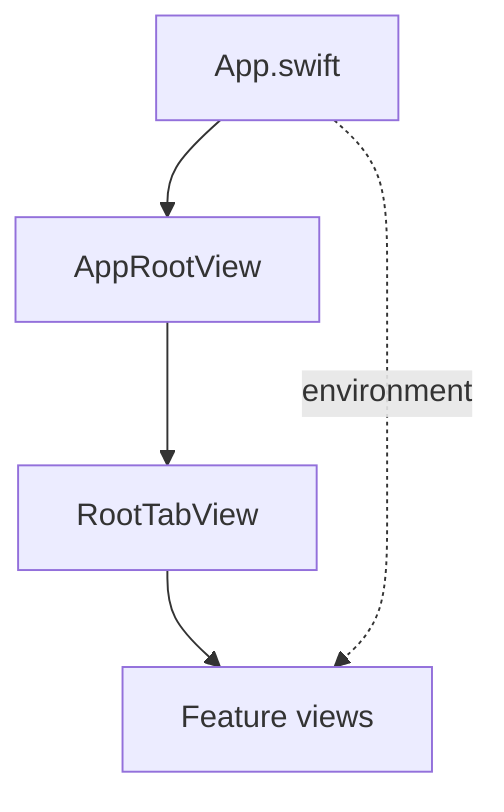
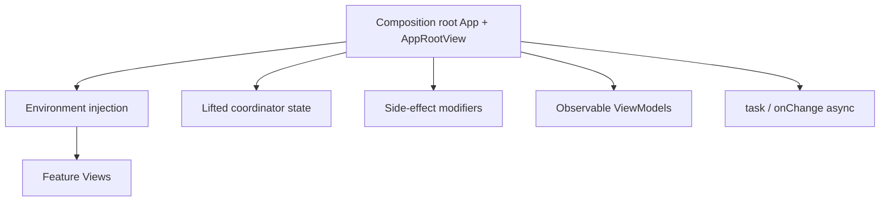

# SwiftUI-Specific Patterns

## Definition

Patterns that emerge from **SwiftUI's composition model** rather than classic Gang-of-Four catalogs. FocusUp combines these with MVVM-C and manual DI.

---

## 1. Environment injection

**Concept:** Propagate shared dependencies down the view tree without constructor drilling.

```swift
@Environment(\.appContainer) private var container
@Environment(\.hapticsEnabled) private var hapticsEnabled
```

**Files:**
- `Core/DependencyInjection/AppContainer.swift` — `AppContainerKey`
- `App/App.swift` — `.appContainer(.live)`



**Interview line:** "Composition root sets `\.appContainer`; features read managers and repos from environment."

---

## 2. Composition root

**Concept:** One place wires the object graph before UI renders.

| Layer | File | Role |
|-------|------|------|
| App entry | `App/App.swift` | `ModelContainer`, `.appContainer(.live)` |
| Scene root | `App/AppRootView.swift` | Cold restore, modifiers, scene phase |

```swift
// App.swift (conceptual)
@main
struct FocusUpApp: App {
  var body: some Scene {
    WindowGroup {
      AppRootView()
        .appContainer(.live)
    }
    .modelContainer(...)
  }
}
```

Side-effect modifiers stack on `AppRootView`, not scattered in leaf views.

---

## 3. Lifted state (coordinator-owned navigation)

**Concept:** Navigation `path` and `selectedTab` live in `AppCoordinator`, not in child views.

SwiftUI `NavigationStack` binds to coordinator paths — state is **lifted** to survive view recreation and restoration.

See [mvvm-coordinator.md](mvvm-coordinator.md).

---

## 4. Side-effect modifiers (decorator pattern)

**Concept:** `onChange(of: scenePhase)`, `SceneStorage`, and restoration attach via `ViewModifier` on ancestors.

| Concern | Modifier location |
|---------|-------------------|
| Cold restore trigger | `AppRootView.task` |
| Nav persist | `NavigationRestorationModifier` |
| Timer persist | `FocusTimerRestorationModifier` |

Restore **read** happens in `AppRestorationCoordinator`; modifiers **write** on background.

See [decorator.md](decorator.md).

---

## 5. Observation (`@Observable`)

**Concept:** Swift Observation replaces `ObservableObject` for ViewModels and coordinators.

```swift
@MainActor
@Observable
final class TaskListViewModel { ... }
```

Views read properties directly — no `@Published` / `objectWillChange`.

---

## 6. Structured concurrency in views

**Concept:** `.task { await load() }` ties async work to view lifetime; `Task { }` for fire-and-forget from sync handlers.

```swift
.task {
  await performColdStart()
}
.onChange(of: scenePhase) { _, newPhase in
  guard container.coordinator.hasCompletedColdRestore else { return }
  Task { await AppForegroundRefresh.perform(using: container) }
}
```

**Gate pattern:** `hasCompletedColdRestore` prevents scene-phase work during cold restore.

---

## 7. SceneStorage + dual persistence

**Concept:** `@SceneStorage` for fast per-scene restore; `AppRestorationStore` (UserDefaults) as backup.

Used for navigation paths, timer snapshots, and form drafts.

See [../16-app-restoration-coordinator.md](../16-app-restoration-coordinator.md).

---

## 8. Preview dependency override

**Concept:** `#Preview` blocks call `.appContainer(.preview)` for stub data and NoOp services.

```swift
#Preview {
  TaskListView()
    .appContainer(.preview)
}
```

**File:** `Testing/PreviewSupport/PreviewDependencies.swift`

---

## Pattern map (SwiftUI layer)



---

## Interview answer (45 sec)

> SwiftUI patterns in FocusUp: `App.swift` is the composition root setting `\.appContainer` and the model container. Navigation state is lifted into `AppCoordinator`. Cross-cutting restoration uses ViewModifiers on `AppRootView` with SceneStorage plus UserDefaults backup. ViewModels use `@Observable`; async work uses `.task` and gated `onChange` for scene phase. Previews override with `.appContainer(.preview)`.

---

## Files to know cold

- `App/App.swift`
- `App/AppRootView.swift`
- `Core/DependencyInjection/AppContainer.swift`
- `Testing/PreviewSupport/PreviewDependencies.swift`

---

## Related patterns

- [dependency-injection.md](dependency-injection.md) — environment is DI transport
- [decorator.md](decorator.md) — ViewModifier decorators
- [mvvm-coordinator.md](mvvm-coordinator.md) — lifted navigation state
- [singleton.md](singleton.md) — `.live` at composition root
